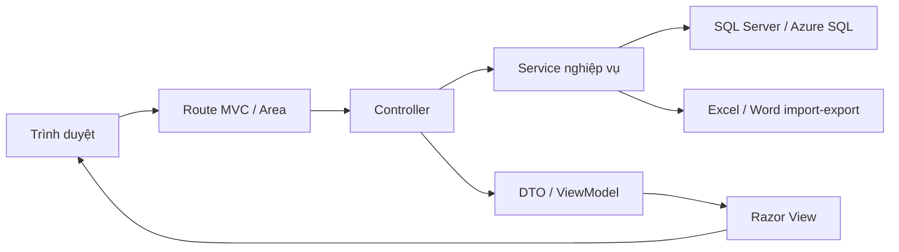

# Bối cảnh dự án HospitalQualityDashboard-demo

Tài liệu này tóm tắt bối cảnh nghiệp vụ và kỹ thuật của `HospitalQualityDashboard-demo` để developer, tester, BA và trợ lý AI có cùng cách hiểu trước khi sửa hệ thống.

## 1. Mục tiêu nghiệp vụ

Ứng dụng hỗ trợ bệnh viện quản lý bộ chỉ số chất lượng theo chu kỳ báo cáo. Bài toán trung tâm là biến danh mục chỉ số, khoa/phòng phụ trách và kỳ báo cáo thành các slot cần nộp rõ ràng; sau đó theo dõi slot nào đã nộp, còn thiếu, quá hạn, đạt hoặc chưa đạt mục tiêu.

Người dùng chính:

- **Admin/phòng quản lý chất lượng**: cấu hình danh mục, phân công chỉ số, mở/khóa kỳ, theo dõi toàn viện, nhắc hạn, xuất dữ liệu và kiểm tra nhật ký.
- **User khoa/phòng**: xem chỉ số được giao, nhập số liệu định kỳ, lưu nháp, gửi báo cáo và nhận thông báo.

## 2. Phạm vi nghiệp vụ hiện tại

### Danh mục nền

- Khoa/phòng có trạng thái sử dụng để lọc dropdown và phân quyền scope.
- Nhân viên liên kết khoa/phòng; Admin có thể tạo tài khoản User từ nhân viên.
- Tài khoản có hai vai trò chính: Admin và User.
- User có thể cập nhật hồ sơ cá nhân và đổi mật khẩu.

### Chỉ số chất lượng

- Mỗi chỉ số có mã, tên, định nghĩa, công thức, đơn vị tính, nguồn số liệu, tần suất báo cáo và mục tiêu.
- Hệ thống hỗ trợ nhiều loại công thức: tỷ lệ, số lượng, thời gian trung bình, điểm trung bình, giá trị trực tiếp và tỷ số.
- Chỉ số có thể có nhiều tần suất: ngày, tuần, tháng, quý, 6 tháng, 9 tháng, năm, khi phát sinh, trước/sau khi thực hiện.
- Import chỉ số hỗ trợ Excel và Word `.docx` dạng bảng, có logic suy luận một số trường khi file nguồn không chuẩn hoàn toàn.
- Vòng đời triển khai/ngừng triển khai được lưu lịch sử theo tần suất để báo cáo cũ vẫn đúng lịch sử, còn kỳ mới chỉ tính chỉ số còn hiệu lực.

### Phân công và kỳ báo cáo

- Admin phân công chỉ số cho một hoặc nhiều khoa/phòng.
- Kỳ báo cáo có trạng thái `Nhập`, `Mở`, `Khóa`.
- Kỳ có thể tạo thủ công hoặc sinh hàng loạt theo năm/tần suất.
- Automation mở/khóa kỳ và thông báo được kích hoạt thủ công trong app hoặc qua endpoint bảo trì có token; Dashboard không tự chạy tác vụ nặng khi người dùng chỉ mở trang.

### Báo cáo

- User nhập báo cáo theo kỳ đang mở và chỉ số được giao.
- Báo cáo có thể lưu nháp, gửi, quá hạn, khóa, duyệt hoặc trả lại tùy luồng.
- Service tự tính kết quả/chỉ tiêu từ dữ liệu server-side; không tin giá trị tính toán gửi từ client.
- Admin có thể tra cứu, khóa, xóa hoặc xem chi tiết báo cáo toàn viện.
- Modal chi tiết báo cáo dùng chung hỗ trợ xem nhanh dữ liệu từ Dashboard/Report.

### Dashboard và export

- Dashboard Admin tổng hợp toàn viện; Dashboard User luôn bị giới hạn theo khoa/phòng trong session.
- Các KPI chính dựa trên slot cần nộp `(kỳ, khoa/phòng, chỉ số)`.
- Dashboard có drill-down theo metric, cảnh báo chỉ số chưa nộp, so sánh tiến độ nhiều kỳ và xu hướng.
- Export Excel gồm danh sách nghiệp vụ, Dashboard tiến độ và Dashboard chi tiết nhiều sheet.
- Mỗi lần xuất Dashboard chi tiết được ghi vào `LichSuXuatBaoCao` để audit.

### Thông báo và nhật ký

- Admin gửi thông báo thủ công tới khoa/phòng.
- Automation tạo thông báo mở kỳ, nhắc hạn, hạn nộp hôm nay, quá hạn và tổng hợp Admin.
- Cảnh báo theo chỉ số có cơ chế chống gửi trùng trong ngày.
- System log ghi nhận các thao tác quan trọng để Admin tra cứu.

## 3. Kiến trúc kỹ thuật

Ứng dụng là ASP.NET MVC 4 trên .NET Framework 4.7.2. Code dùng MVC Area để tách Admin và User, nhưng chia sẻ cùng tầng Models/Services.



Nguyên tắc phân tầng:

- **Controller** xác thực request, kiểm quyền/scope, map DTO/ViewModel và chọn response.
- **Service** chứa nghiệp vụ, truy cập database, transaction, tính toán và audit.
- **DTO** là hợp đồng giữa controller và service.
- **ViewModel** phục vụ form và màn hình Razor.
- **Entity/Enum** mô tả khái niệm lõi và trạng thái dùng chung.
- **Razor View** chỉ hiển thị/thu thập dữ liệu; không là nguồn bảo mật chính.

## 4. Stack và dependency

- ASP.NET MVC 4, Razor 2, WebPages 2.
- .NET Framework 4.7.2.
- ADO.NET qua `System.Data.SqlClient`; không dùng ORM.
- Bootstrap 5.2.3, jQuery 3.7.0, jQuery Validation 1.19.5.
- Newtonsoft.Json 13.0.3.
- ClosedXML 0.102.2, DocumentFormat.OpenXml 2.16.0, System.IO.Packaging.
- PowerShell scripts trong `tools/` để verify các luồng nghiệp vụ.

## 5. Database và cấu hình

Connection string chuẩn tên `HospitalQualityConnection` và nằm trong file local:

```text
HospitalQualityDashboard-demo/ConnectionStrings.config
```

Repo chỉ commit file mẫu:

```text
HospitalQualityDashboard-demo/ConnectionStrings.example.config
```

`Web.config` dùng:

```xml
<connectionStrings configSource="ConnectionStrings.config" />
```

Các script SQL:

| Script | Vai trò |
|---|---|
| `001_CreateSchema.sql` | Schema ban đầu, bảng lõi, khóa và seed cần thiết. |
| `002_PerformanceIndexes.sql` | Index hiệu năng cho dashboard, báo cáo, phân công, notification. |
| `003_AddExportHistory.sql` | Audit lịch sử xuất Dashboard Excel. |
| `004_AddIndicatorWarning.sql` | Cảnh báo theo chỉ số và chống gửi trùng. |
| `005_AddIndicatorDeploymentHistory.sql` | Lịch sử triển khai chỉ số và hàm lọc hiệu lực theo kỳ. |

`DatabaseBootstrapper` chạy ở `Application_Start()` nếu bật cấu hình. Chỉ bật ở dev/test hoặc khi cần migration có kiểm soát.

## 6. Module chính

| Module | Thành phần chính | Ghi chú |
|---|---|---|
| Authentication | `AccountController`, `PageController`, `AuthService`, `PasswordHasher`, `SessionUserAccessor` | Đăng nhập, session, revalidate, đổi mật khẩu, profile. |
| Department | `DepartmentController`, `DepartmentService` | CRUD/import/export khoa/phòng, cache dropdown. |
| Employee | `EmployeeController`, `EmployeeService` | CRUD/import nhân viên, tạo tài khoản User. |
| Indicator | `IndicatorController`, `IndicatorService.*` | Định nghĩa, import, công thức, tần suất, triển khai/ngừng triển khai. |
| Assignment | `AssignmentController`, `AssignmentService.*` | Phân công chỉ số, preview, bulk action, grouping. |
| Reporting Period | `ReportingPeriodController`, `ReportingPeriodService`, `ReportingPeriodScheduleService`, `ReportingPeriodMaintenanceService` | Kỳ báo cáo, sinh lịch, mở/khóa kỳ, endpoint bảo trì. |
| Report | `ReportController`, `ReportService`, `IndicatorCalculationService` | Nhập/lưu/gửi/khóa/xóa báo cáo, tính kết quả. |
| Dashboard | `DashboardController`, `DashboardService.*`, comparison/progress builders | Tổng hợp, chi tiết metric, thiếu/quá hạn, so sánh kỳ, xu hướng. |
| Export | `ExportController`, `ExportService`, `DashboardExcelExportService.*`, `ExcelImportExportService.*` | XLSX nhiều sheet, import Excel/Word, audit export. |
| Notification | `NotificationController`, `NotificationService`, `NotificationAutomationService`, `IndicatorWarningMessageBuilder` | Thông báo thủ công/tự động, badge chưa đọc, cảnh báo chỉ số. |
| System Log | `SystemLogController`, `SystemLogService`, `SystemLogDtos` | Tra cứu nhật ký hệ thống phía Admin. |

## 7. Phân quyền và scope dữ liệu

- Admin được xem và thao tác dữ liệu toàn viện.
- User chỉ được xem dữ liệu thuộc `KhoaPhongId` trong session.
- `AdminBaseController` và `UserBaseController` ép role ở server-side.
- Service nhận context/scope từ controller, đặc biệt trong Dashboard, Report, Export và Notification.
- UI có thể ẩn nút theo vai trò, nhưng kiểm quyền bắt buộc nằm ở controller/service.

## 8. Hiệu năng và vận hành

- Session không gọi database ở mọi request; chỉ revalidate định kỳ hoặc khi thiếu dữ liệu bắt buộc.
- Dropdown ít thay đổi dùng cache ngắn hạn và xóa cache sau CRUD/import liên quan.
- Dashboard dùng query tổng hợp/CTE, tránh nhiều round-trip nhỏ.
- Danh sách quản lý dùng phân trang server-side.
- `DbServiceBase` hỗ trợ command timeout và transaction.
- Import file lớn vẫn chạy đồng bộ trong request; khi dữ liệu nhiều nên chia file hoặc thiết kế background job riêng.
- Các tác vụ automation kỳ báo cáo không chạy ngầm khi chỉ mở Dashboard/Report.

## 9. Kiểm thử hiện có

Chưa có test project unit/integration chính thức. Repo dùng build, Razor compile, checklist thủ công và các script verify trong `tools/`.

Các nhóm verify đáng chú ý:

- Dashboard tổng hợp, chi tiết, Excel, so sánh kỳ, simple cards.
- Cảnh báo chỉ số, notification dropdown, badge chưa đọc.
- Vòng đời triển khai chỉ số.
- Bảo trì kỳ báo cáo và migration SQL.
- Modal chi tiết báo cáo, điều hướng sau gửi báo cáo, audit Admin.
- System log, sidebar navigation groups, phân trang quản lý.

## 10. Rủi ro cần nhớ

- Không commit `ConnectionStrings.config` hoặc credential thật.
- Không xử lý dữ liệu nhạy cảm của bệnh viện trong file mẫu, ảnh chụp hoặc log chia sẻ.
- Khi thêm enum/trạng thái mới phải rà SQL, dropdown, format label, import/export và báo cáo.
- Khi thêm file vào project kiểu `.csproj` cũ, cần bảo đảm file được include đúng `Compile`, `Content` hoặc `None`.
- Khi chỉnh SQL migration phải giữ idempotent vì script có thể chạy lại qua bootstrap hoặc verify.
- Khi chỉnh Dashboard/Export phải kiểm tra cả scope Admin và scope User.
