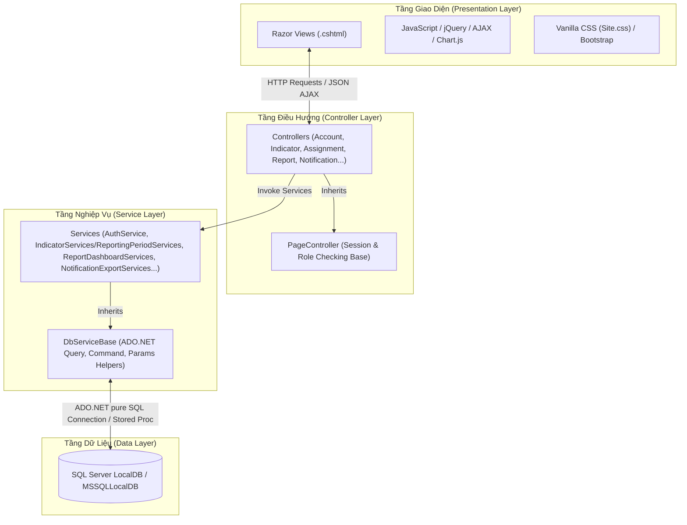
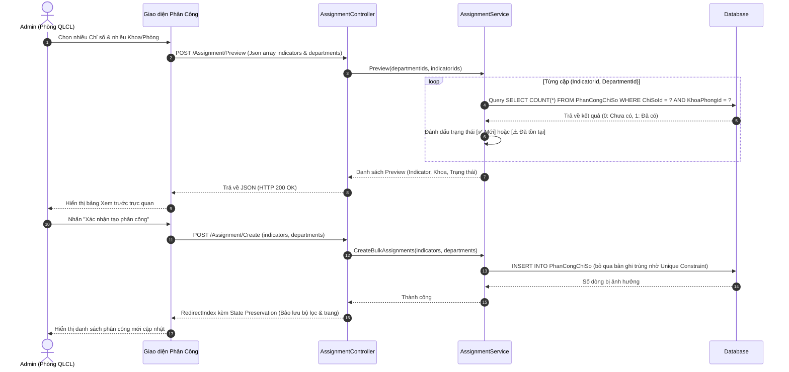
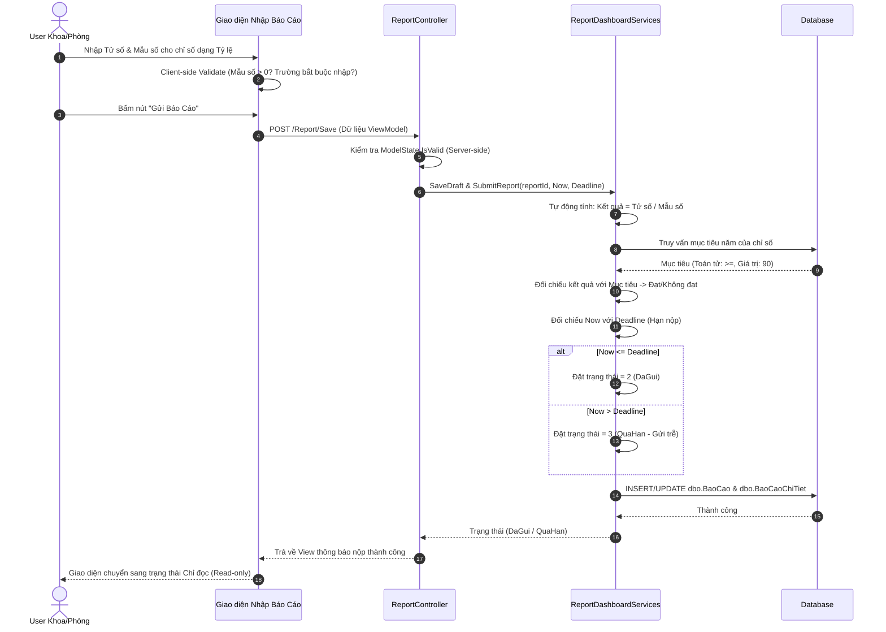
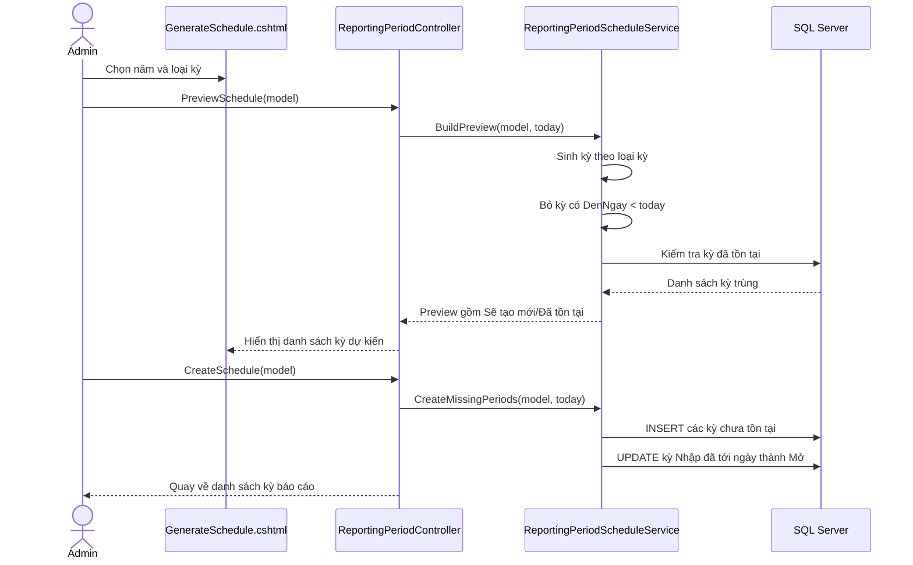

# TÀI LIỆU PHÂN TÍCH THIẾT KẾ HỆ THỐNG CHI TIẾT (SYSTEM DESIGN DOCUMENT - SDD)
## Dự án: Phần mềm Quản lý Bộ chỉ số Chất lượng Bệnh viện (HospitalQualityDashboard)

Chào bạn, với tư cách là **System Architect & Designer**, tôi xin trình bày tài liệu Phân tích và Thiết kế Hệ thống chi tiết (System Design Document - SDD) cho hệ thống `HospitalQualityDashboard`. Tài liệu này phân tích chi tiết từ kiến trúc, sơ đồ UML lớp, sơ đồ tuần tự, thiết kế cơ sở dữ liệu vật lý đến các thuật toán nghiệp vụ đặc thù đang vận hành trong dự án.

---

## 1. Kiến Trúc Hệ Thống (System Architecture)

Hệ thống được thiết kế theo mô hình **MVC (Model-View-Controller)** cổ điển kết hợp với **Service Layer** để cô lập nghiệp vụ truy xuất cơ sở dữ liệu. Nhằm đạt hiệu năng tối đa cho môi trường quản trị bệnh viện, dự án sử dụng **ADO.NET thuần** thay vì Object-Relational Mapping (ORM) cồng kềnh như Entity Framework.

### 1.1. Sơ đồ các tầng kiến trúc vật lý (Logical 3-Tier Layer)


### 1.2. Sơ đồ Triển khai Vật lý (Deployment Diagram)
```mermaid
deploymentDiagram
    node Browser ["Client Browser (Chrome, Edge, Firefox)"] {
        artifact UI ["HTML5, CSS3, JS, AJAX"]
    }
    node WebServer ["IIS Express / IIS Web Server (.NET 4.7.2 Runtime)"] {
        artifact MVCApp ["HospitalQualityDashboard.dll"]
    }
    node DBServer ["SQL Server Database Engine"] {
        database LocalDB ["HospitalQualityDashboard DB"]
    }

    Browser -- "HTTP / HTTPS (Port 44387)" --> WebServer
    WebServer -- "ADO.NET SQLClient Provider" --> DBServer
```

---

## 2. Đặc Tả Thiết Kế Phần Mềm (Software Design)

### 2.1. Sơ đồ Lớp Chi Tiết (Class Diagram)
Dưới đây là sơ đồ các lớp nghiệp vụ quan trọng trong việc xử lý **Chỉ số, Phân công, và Báo cáo**:

```mermaid
classDiagram
    class DbServiceBase {
        #string connectionString
        #Query(string sql, object parameters) List~T~
        #Execute(string sql, object parameters) int
        #Scalar(string sql, object parameters) object
    }

    class IndicatorServices {
        +GetAllIndicatorGroups(int filterKhoaId, int filterChiSoId, int page, int pageSize) List~IndicatorGroupViewModel~
        +GetFrequenciesForDepartment(int khoaPhongId) List~string~
        +SyncFromIndicatorSources() int
        +CreateBulkAssignments(int[] indicatorIds, int[] departmentIds) int
        -BuildIndicatorFromRow(Dictionary row) ChiSoViewModel
        -InferFormulaType(ChiSoViewModel model) LoaiCongThuc
        -InferUnit(ChiSoViewModel model) string
    }

    class AssignmentService {
        +Preview(int[] departmentIds, int[] indicatorIds) PreviewAssignmentResultViewModel
        +GetStatistics() AssignmentViewModel
        +GetAllDepartmentGroups(...) List~DepartmentAssignmentGroup~
        +GetAllIndicatorGroups(...) List~IndicatorAssignmentGroup~
        +Assign(AssignmentCommandDto dto) void
    }

    class ReportingPeriodServices {
        +BuildSchedulePreview(...) List~ReportingPeriodSchedulePreviewItemViewModel~
        +GenerateSchedule(...) ReportingPeriodScheduleResultViewModel
        +OpenDuePeriods(DateTime now) int
    }

    class ReportDashboardServices {
        +GetAssignedForUser(int khoaPhongId, int kyBaoCaoId) List~ReportEntryViewModel~
        +GetMissingReportsForDepartment(int khoaPhongId, int kyBaoCaoId) List~MissingReportAlertViewModel~
        +SaveDraft(ReportEntryViewModel model) int
        +SubmitReport(int reportId, DateTime submitTime, DateTime deadline) string
        +LockReport(int reportId) int
        +DeleteReport(int reportId) int
    }

    class PageController {
        #SessionUserAccessor UserAccessor
        #RequireAdmin() void
        #EnsureUserDepartment(int deptId) void
    }

    class AssignmentController {
        -AssignmentService _service
        +Index(int filterKhoaId, int filterChiSoId, int page) ActionResult
        +Preview(int[] departmentIds, int[] indicatorIds) JsonResult
        +BulkDeactivate(int[] ids) ActionResult
        +BulkActivate(int[] ids) ActionResult
        +BulkDelete(int[] ids) ActionResult
    }

    class ReportController {
        -ReportDashboardServices _reportService
        -ReportingPeriodServices _periodService
        +Index(int? kyBaoCaoId) ActionResult
        +Edit(int reportId) ActionResult
        +Save(ReportEntryViewModel model) ActionResult
    }

    DbServiceBase <|-- IndicatorServices
    DbServiceBase <|-- AssignmentService
    DbServiceBase <|-- ReportDashboardServices
    DbServiceBase <|-- ReportingPeriodServices
    PageController <|-- AssignmentController
    PageController <|-- ReportController
    AssignmentController --> AssignmentService
    ReportController --> ReportDashboardServices
    ReportController --> ReportingPeriodServices
```



### 2.2. Sơ đồ Tuần tự (Sequence Diagrams)

#### Kịch bản 1: Đồng bộ Phân công & Xem trước hàng loạt bằng AJAX Preview (Bulk Assignment)
Khi Admin kéo chọn nhiều Chỉ số và nhiều Khoa/Phòng, hệ thống không tạo mù quáng xuống DB mà gọi AJAX Preview hiển thị trạng thái `✅ Mới` hoặc `⚠️ Đã tồn tại`.



#### Kịch bản 2: User Khoa/Phòng nhập số liệu, tính toán, đối chiếu Hạn nộp & Gửi báo cáo


---

## 3. Thiết Kế Cơ Sở Dữ Liệu Vật Lý (Database Physical Schema)

Dưới đây là chi tiết Data Dictionary của các bảng cốt lõi trong cơ sở dữ liệu `HospitalQualityDashboard`.

### 3.1. Bảng `KhoaPhong` (Danh mục khoa/phòng)
| Tên Cột | Kiểu Dữ Liệu | Ràng Buộc | Mô tả |
| :--- | :--- | :--- | :--- |
| `Id` | `int` | `PK, Identity` | Khóa chính tự tăng |
| `MaKhoaPhongNguon` | `nvarchar(50)` | `Unique, Nullable` | Mã ánh xạ từ hệ thống cũ / Excel |
| `TenKhoaPhong` | `nvarchar(250)` | `Not Null` | Tên khoa/phòng (tiếng Việt có dấu) |
| `DangHoatDong` | `bit` | `Not Null, Default 1` | Trạng thái sử dụng (1: Hoạt động, 0: Ngừng) |

### 3.2. Bảng `ChiSoChatLuong` (Danh mục chỉ số chất lượng)
| Tên Cột | Kiểu Dữ Liệu | Ràng Buộc | Mô tả |
| :--- | :--- | :--- | :--- |
| `Id` | `int` | `PK, Identity` | Khóa chính tự tăng |
| `MaChiSo` | `nvarchar(50)` | `Unique, Not Null` | Mã chỉ số (ví dụ: CS_QT_01) |
| `TenChiSo` | `nvarchar(500)` | `Not Null` | Tên đầy đủ của chỉ số |
| `DinhNghia` | `nvarchar(max)` | `Nullable` | Mô tả định nghĩa chỉ số |
| `PhuongPhapTinh` | `nvarchar(max)` | `Nullable` | Mô tả công thức bằng lời |
| `LoaiCongThuc` | `nvarchar(50)` | `Not Null` | Phân loại công thức (`TyLe`, `SoLuong`, `GiaTriTrucTiep`...) |
| `TuSoGiaiThich` | `nvarchar(500)` | `Nullable` | Giải thích tử số |
| `MauSoGiaiThich` | `nvarchar(500)` | `Nullable` | Giải thích mẫu số |
| `DonViTinh` | `nvarchar(50)` | `Nullable` | Đơn vị tính hiển thị/nhập liệu; nếu file import không có cột này, service tự suy luận theo tên chỉ số và loại công thức |
| `DangHoatDong` | `bit` | `Not Null, Default 1` | Trạng thái hoạt động |

### 3.3. Bảng `ChiSoTanSuatBaoCao` (Tần suất phụ của chỉ số)
| Tên Cột | Kiểu Dữ Liệu | Ràng Buộc | Mô tả |
| :--- | :--- | :--- | :--- |
| `Id` | `int` | `PK, Identity` | Khóa chính |
| `ChiSoChatLuongId` | `int` | `FK -> ChiSoChatLuong(Id)` | Tham chiếu chỉ số chính |
| `TanSuatBaoCao` | `nvarchar(50)` | `Not Null` | Giá trị tần suất (Thang, Quy, Nam...) |

### 3.4. Bảng `PhanCongChiSo` (Bảng trung gian phân công)
| Tên Cột | Kiểu Dữ Liệu | Ràng Buộc | Mô tả |
| :--- | :--- | :--- | :--- |
| `Id` | `int` | `PK, Identity` | Khóa chính |
| `ChiSoChatLuongId` | `int` | `FK -> ChiSoChatLuong(Id)` | Tham chiếu chỉ số |
| `KhoaPhongId` | `int` | `FK -> KhoaPhong(Id)` | Tham chiếu khoa phòng phụ trách |
| `DangHoatDong` | `bit` | `Not Null, Default 1` | Trạng thái phân công (1: Báo cáo, 0: Tạm dừng) |

> [!IMPORTANT]
> **Ràng buộc Toàn vẹn cực kỳ quan trọng:**
> Bảng `PhanCongChiSo` bắt buộc có Unique Constraint:
> ```sql
> ALTER TABLE dbo.PhanCongChiSo ADD CONSTRAINT UQ_PhanCong_ChiSo_Khoa UNIQUE (ChiSoChatLuongId, KhoaPhongId);
> ```
> Điều này đảm bảo không bao giờ tồn tại hai dòng phân công trùng lặp cho cùng một khoa trên cùng một chỉ số.

### 3.5. Bảng `BaoCao` và `BaoCaoChiTiet` (Dữ liệu nhập liệu)
#### Bảng `BaoCao`
| Tên Cột | Kiểu Dữ Liệu | Ràng Buộc | Mô tả |
| :--- | :--- | :--- | :--- |
| `Id` | `int` | `PK, Identity` | Khóa chính |
| `KyBaoCaoId` | `int` | `FK -> KyBaoCao(Id)` | Kỳ báo cáo |
| `KhoaPhongId` | `int` | `FK -> KhoaPhong(Id)` | Khoa phòng thực hiện nộp |
| `PhanCongChiSoId` | `int` | `FK -> PhanCongChiSo(Id)` | Liên kết với bản ghi phân công cụ thể |
| `TrangThai` | `int` | `Not Null` | 1: Nhập nháp, 2: Đã gửi đúng hạn, 3: Gửi quá hạn, 4: Đã khóa |

#### Bảng `BaoCaoChiTiet`
| Tên Cột | Kiểu Dữ Liệu | Ràng Buộc | Mô tả |
| :--- | :--- | :--- | :--- |
| `Id` | `int` | `PK, Identity` | Khóa chính |
| `BaoCaoId` | `int` | `FK -> BaoCao(Id) ON DELETE CASCADE` | Tham chiếu bản ghi cha |
| `TuSo` | `float` | `Nullable` | Giá trị tử số |
| `MauSo` | `float` | `Nullable` | Giá trị mẫu số |
| `GiaTriNhap` | `float` | `Nullable` | Giá trị nếu nhập trực tiếp (không tính tỷ lệ) |
| `KetQua` | `float` | `Nullable` | Kết quả sau khi tính toán |
| `DatMucTieu` | `bit` | `Nullable` | Trạng thái đạt mục tiêu (1: Đạt, 0: Không đạt) |
| `GhiChu` | `nvarchar(max)` | `Nullable` | Ý kiến/Giải trình của khoa |

---

## 4. Thiết Kế Thuật Toán Nghiệp Vụ Đặc Thù (Core Algorithms)

### 4.1. Thuật toán sinh slot báo cáo động (Reporting Slots Dynamic LEFT JOIN)
Hệ thống không sinh trước dòng trống xuống database khi mở kỳ báo cáo. Khi User vào màn hình báo cáo, hệ thống thực hiện câu truy vấn `LEFT JOIN` thời gian thực.

#### Câu lệnh SQL cốt lõi để sinh slot báo cáo động:
```sql
SELECT
    pc.Id AS PhanCongChiSoId,
    cs.Id AS ChiSoId,
    cs.MaChiSo,
    cs.TenChiSo,
    cs.LoaiCongThuc,
    cs.DonViTinh,
    cs.TuSoGiaiThich,
    cs.MauSoGiaiThich,
    bc.Id AS BaoCaoId,
    bc.TrangThai AS ReportStatus,
    ct.TuSo,
    ct.MauSo,
    ct.GiaTriNhap,
    ct.KetQua,
    ct.DatMucTieu,
    ct.GhiChu
FROM dbo.PhanCongChiSo pc
INNER JOIN dbo.ChiSoChatLuong cs ON pc.ChiSoChatLuongId = cs.Id
-- LEFT JOIN sang bảng tần suất chi tiết để đảm bảo chỉ số có tần suất phù hợp với loại kỳ báo cáo
INNER JOIN dbo.ChiSoTanSuatBaoCao ts ON cs.Id = ts.ChiSoChatLuongId
LEFT JOIN dbo.BaoCao bc ON bc.PhanCongChiSoId = pc.Id AND bc.KyBaoCaoId = @KyBaoCaoId
LEFT JOIN dbo.BaoCaoChiTiet ct ON ct.BaoCaoId = bc.Id
WHERE pc.KhoaPhongId = @KhoaPhongId
  AND pc.DangHoatDong = 1
  AND cs.DangHoatDong = 1
  AND ts.TanSuatBaoCao = @LoaiKyBaoCao; -- Lọc đúng loại kỳ: Tháng, Quý, Nam...
```

*Ý nghĩa*: Câu query này đảm bảo hệ thống không lưu trữ thừa dữ liệu nháp. Khi Admin thay đổi phân công (Thêm/Tạm dừng/Xóa), danh sách slot báo cáo của User tự động cập nhật ngay lập tức mà không cần đồng bộ DB phức tạp.

---

### 4.2. Thuật toán lọc kỳ báo cáo thông minh theo quyền User
Tránh việc User Khoa/Phòng thấy tất cả các kỳ đang mở gây bối rối, hệ thống lọc kỳ theo tần suất của các chỉ số mà khoa đó đang thực tế phụ trách.

#### Mô phỏng C# xử lý bộ lọc thông minh:
```csharp
public List<KyBaoCaoViewModel> GetSmartPeriodsForUser(int khoaPhongId)
{
    // Bước 1: Lấy danh sách tần suất hoạt động của khoa phòng đó
    List<string> activeFrequencies = _db.Query<string>(@"
        SELECT DISTINCT ts.TanSuatBaoCao
        FROM dbo.PhanCongChiSo pc
        INNER JOIN dbo.ChiSoChatLuong cs ON pc.ChiSoChatLuongId = cs.Id
        INNER JOIN dbo.ChiSoTanSuatBaoCao ts ON cs.Id = ts.ChiSoChatLuongId
        WHERE pc.KhoaPhongId = @KhoaPhongId
          AND pc.DangHoatDong = 1
          AND cs.DangHoatDong = 1",
        new { KhoaPhongId = khoaPhongId });

    // Bước 2: Truy vấn kỳ báo cáo đang Mở và so khớp tần suất
    List<KyBaoCao> allOpenPeriods = _db.GetAllOpenPeriods();

    // Chỉ lấy các kỳ báo cáo có loại chu kỳ (LoaiKy) nằm trong tập activeFrequencies
    return allOpenPeriods
        .Where(p => activeFrequencies.Contains(p.LoaiKy))
        .Select(p => MapToViewModel(p))
        .ToList();
}
```

---

### 4.3. Thuật toán chống gửi trùng thông báo (Idempotent Notification Auto-Log)
Hệ thống chạy ngầm kiểm tra và gửi thông báo nhắc việc tự động (Mở kỳ, Sắp đến hạn, Quá hạn). Để tránh tạo nhiều thông báo rác, thuật toán áp dụng cơ chế idempotent kiểm tra `DedupKey`.

#### Quy trình tính toán & kiểm tra:
1. Xác định sự kiện cần tạo thông báo (Ví dụ: Sự kiện Nhắc hạn nộp của Khoa Ngoại ở Kỳ báo cáo Quý 1/2026).
2. Tạo mã khóa duy nhất `DedupKey`:
   `DedupKey = "NHAC_HAN_" + KyBaoCaoId + "_" + KhoaPhongId`
3. Thực hiện thủ tục kiểm tra và ghi nhận:
```sql
-- Kiểm tra xem đã gửi thông báo trùng chưa
IF NOT EXISTS (SELECT 1 FROM dbo.ThongBaoTuDongLog WHERE DedupKey = @DedupKey)
BEGIN
    BEGIN TRANSACTION
        -- 1. Thêm bản ghi thông báo cha
        INSERT INTO dbo.ThongBao (TieuDe, NoiDung, LoaiThongBao, KyBaoCaoId, NgayTao)
        VALUES (@TieuDe, @NoiDung, @LoaiThongBao, @KyBaoCaoId, GETDATE());

        DECLARE @ThongBaoId INT = SCOPE_IDENTITY();

        -- 2. Thêm bản ghi người nhận (User của khoa phòng)
        INSERT INTO dbo.ThongBaoNguoiNhan (ThongBaoId, TaiKhoanId, DaDoc)
        SELECT @ThongBaoId, tk.Id, 0
        FROM dbo.TaiKhoan tk
        WHERE tk.KhoaPhongId = @KhoaPhongId;

        -- 3. Ghi log chống trùng lặp
        INSERT INTO dbo.ThongBaoTuDongLog (DedupKey, NgayGui)
        VALUES (@DedupKey, GETDATE());
    COMMIT TRANSACTION
END
```

---

### 4.4. Thuật toán suy luận loại công thức và đơn vị tính khi import DOCX

File nghiệp vụ `Phân chia các chỉ số dựa theo đơn vị thu thập và tổng hợp.docx` có đủ thông tin mô tả chỉ số nhưng không có nhãn/cột riêng cho `Đơn vị tính`. Vì vậy hệ thống không thay đổi schema, mà bổ sung xử lý trong `IndicatorServices.BuildIndicatorFromRow`:

1. Parser DOCX đọc các nhãn tiếng Việt và map vào `ChiSoViewModel`.
2. Nếu dòng import đã có `LoaiCongThuc`, hệ thống giữ nguyên giá trị trong file.
3. Nếu thiếu `LoaiCongThuc`, hệ thống gọi `InferFormulaType(model)` để suy luận từ tên chỉ số, phương pháp tính, tử số và mẫu số.
4. Nếu dòng import đã có `DonViTinh`, hệ thống ưu tiên giữ nguyên giá trị trong file.
5. Nếu thiếu `DonViTinh`, hệ thống gọi `InferUnit(model)` để suy luận đơn vị tính.

#### Quy tắc chuẩn hóa tên chỉ số

- Chuẩn hóa tiếng Việt về dạng không dấu, chữ thường.
- Bỏ số thứ tự đầu tên chỉ số như `1.`, `8.`, `10.` trước khi nhận diện.
- Các cụm `Tỷ lệ`, `Tỷ suất`, `Công suất`, `Hiệu suất` được nhận diện là `TyLe`.
- Các cụm `Tỷ số` được nhận diện là `TySo`.
- Các cụm bắt đầu bằng `Số lượng`, `Số ca`, `Số lượt` được nhận diện là `SoLuong` trước khi xét chữ `điểm`, để tránh nhầm chỉ số `Số lượng các điểm tiếp nối...` thành `DiemTrungBinh`.

#### Quy tắc suy luận đơn vị tính

| Nhóm chỉ số | Đơn vị tính |
| :--- | :--- |
| Tỷ lệ, tỷ suất, công suất, hiệu suất | `%` |
| Tỷ số Bác sĩ/giường bệnh | `bác sĩ/giường bệnh` |
| Tỷ số Điều dưỡng/giường bệnh | `điều dưỡng/giường bệnh` |
| Tỷ số Bác sĩ/Điều dưỡng | `bác sĩ/điều dưỡng` |
| Tỷ số Dược sĩ/giường bệnh | `dược sĩ/giường bệnh` |
| Tỷ số Nhân viên dinh dưỡng/giường bệnh | `nhân viên dinh dưỡng/giường bệnh` |
| Tỷ số Bác sĩ có chứng chỉ phẫu thuật nội soi/tổng số phẫu thuật viên | `bác sĩ có chứng chỉ/phẫu thuật viên` |
| Thời gian xử lý sự cố hệ thống mạng và máy chủ | `giờ` |
| Thời gian khám bệnh trung bình của người bệnh | `phút` |
| Thời gian nằm viện trung bình | `ngày` |
| Các chỉ số số lượng người bệnh/cán bộ/bác sĩ | `người` |
| Số lượng báo cáo phản ứng có hại của thuốc | `báo cáo` |
| Số ca phẫu thuật | `ca` |
| Số lượt khám bệnh | `lượt` |
| Số lượng buồng vệ sinh | `buồng` |
| Số lượng các điểm tiếp nối vật lý | `điểm tiếp nối` |
| Số lượng cầu thang bộ được dán dấu cản quang | `cầu thang` |
| Vi tính hóa quản lý trang thiết bị y tế khối nội | `mức độ` |

Nếu không match rule chi tiết, hệ thống fallback theo `LoaiCongThuc`: `TyLe -> %`, `TySo -> tỷ số`, `SoLuong -> số lượng`, `ThoiGianTrungBinh -> thời gian`, `DiemTrungBinh -> điểm`, `GiaTriTrucTiep -> giá trị`.

#### Kiểm chứng

Các case bắt buộc cần kiểm tra cho import công thức gồm: alias nhãn DOCX, suy luận công thức, ưu tiên `DonViTinh` có sẵn trong file, suy luận các đơn vị tỷ số/thời gian/số lượng. Probe thực tế trên file DOCX nguồn xác nhận parser đọc được 55/55 chỉ số và không còn dòng thiếu `DonViTinh`.

---

### 4.5. Thiết kế tạo lịch kỳ báo cáo tự động

Chức năng tạo lịch tự động được thiết kế để Admin tạo hàng loạt `KyBaoCao` theo năm, đồng thời giữ nguyên nguyên tắc sinh slot báo cáo động. Hệ thống không tạo trước bản ghi `BaoCao` rỗng.

#### Luồng xử lý tổng quát



#### Các loại kỳ được sinh

| Loại kỳ | Enum | Khoảng thời gian |
| :--- | :--- | :--- |
| Hàng ngày | `HangNgay` | Mỗi ngày một kỳ, `TuNgay = DenNgay`. |
| Hàng tháng | `HangThang` | Ngày đầu tháng đến ngày cuối tháng. |
| Hàng quý | `HangQuy` | Ngày đầu quý đến ngày cuối quý. |
| 6 tháng | `SauThang` | 01/01-30/06 và 01/07-31/12. |
| 9 tháng | `ChinThang` | 01/01-30/09. |
| Hàng năm | `HangNam` | 01/01-31/12. |

Không sinh lịch tự động cho `KhiPhatSinh` và `TruocSauKhiThucHien`, vì hai loại kỳ này không có lịch cố định theo năm.

#### Quy tắc thời gian

Các cột ngày trong database vẫn lưu dạng ngày, nhưng nghiệp vụ hiểu theo mốc thời gian:

```text
TuNgay  = 00:00 ngày bắt đầu kỳ
DenNgay = 23:59 ngày kết thúc kỳ
HanNop  = 23:59 ngày kết thúc kỳ
```

Vì vậy `HanNop` của lịch tự động bằng `DenNgay`. Ví dụ kỳ Tháng 06/2026 mở lúc 00:00 ngày 01/06/2026, đóng lúc 23:59 ngày 30/06/2026 và hạn nộp cuối cùng cũng là 23:59 ngày 30/06/2026.

Khi User gửi báo cáo, service không so sánh giờ vật lý vì DB không lưu giờ. Hệ thống đánh `QuaHan` khi:

```sql
CAST(GETDATE() AS date) > KyBaoCao.HanNop
```

Do đó gửi trong đúng ngày hạn nộp vẫn là đúng hạn; gửi từ ngày hôm sau mới là quá hạn.

#### Quy tắc bỏ kỳ đã kết thúc

Khi preview, service loại bỏ kỳ có:

```text
DenNgay < today
```

Ví dụ nếu hôm nay là 30/05/2026:

- Hàng ngày bỏ 01/01/2026 đến 29/05/2026.
- Hàng tháng bỏ Tháng 01 đến Tháng 04/2026.
- Tháng 05/2026 vẫn còn vì kết thúc 31/05/2026.
- Tháng 06/2026 trở đi được preview là kỳ tương lai.

Quy tắc này giúp Admin không tạo nhầm các kỳ quá khứ đã hết giá trị vận hành khi triển khai giữa năm.

#### Quy tắc trạng thái

| Điều kiện | Trạng thái tạo/cập nhật |
| :--- | :--- |
| `TuNgay <= today` | `Mo` |
| `TuNgay > today` | `Nhap` |
| `TrangThai = Nhap` và `TuNgay <= today` | Tự chuyển sang `Mo` |

Hệ thống không tự chuyển kỳ sang `Khoa` sau hạn nộp. Lý do là nghiệp vụ hiện tại vẫn cho phép User gửi trễ, khi đó bản ghi `BaoCao` được đánh `QuaHan`.

#### Quy tắc chống trùng

Khóa nghiệp vụ để kiểm tra trùng:

```text
LoaiKyBaoCao + TuNgay + DenNgay
```

Không dùng `TenKy` làm khóa vì tên kỳ là dữ liệu hiển thị, có thể thay đổi cách đặt tên mà không làm thay đổi bản chất kỳ.

#### Tương tác với cơ chế slot báo cáo động

Sau khi lịch được tạo, User vẫn không có bản ghi `BaoCao` cho tới khi lưu nháp hoặc gửi. Khi User vào màn hình Báo cáo, hệ thống dùng truy vấn động:

- lọc kỳ đang `Mo`;
- lọc tần suất khớp kỳ;
- lọc chỉ số đang hoạt động;
- lọc phân công đang hoạt động của khoa/phòng User;
- LEFT JOIN sang `BaoCao` nếu đã có dữ liệu.

Thiết kế này giúp danh sách cần báo cáo luôn phản ánh phân công mới nhất và tránh dữ liệu rỗng.

---

## 5. Thiết Kế Giao Diện & Cơ Chế Bảo Lưu Trạng Thái (State Preservation)

Một trong những tối ưu UX lớn nhất của hệ thống là việc duy trì trạng thái tìm kiếm/phân trang của Admin khi thực hiện các hành động CRUD phân công chỉ số.

### Luồng truyền tham số bảo lưu trạng thái:
```text
Trang danh sách phân công (Index)
  --> Có các tham số URL: page=3, filterKhoaId=5, search="Nhiễm khuẩn"

Khi Admin bấm nút "Tạm dừng" phân công số 45:
  --> Bấm nút sẽ gọi đến: Action Deactivate(id=45, page=3, filterKhoaId=5, search="Nhiễm khuẩn")

Xử lý tại Controller:
  --> Gọi Service đổi trạng thái phân công 45 thành DangHoatDong = 0.
  --> Thực hiện Redirect to Action Index kèm theo Route values giữ nguyên: page=3, filterKhoaId=5, search="Nhiễm khuẩn".

Kết quả:
  --> Admin vẫn đứng yên tại trang số 3, bộ lọc khoa phòng 5 và từ khóa tìm kiếm "Nhiễm khuẩn" được giữ nguyên, mang lại cảm giác mượt mà và không gây gián đoạn trải nghiệm.
```
