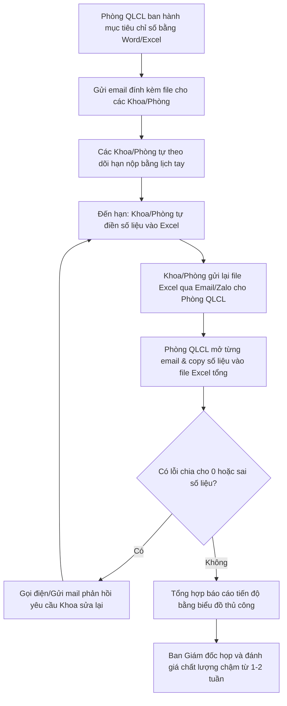
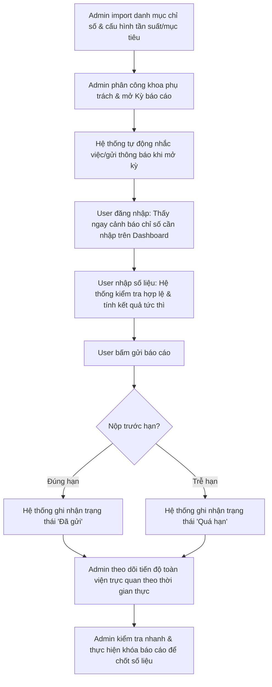

# TÀI LIỆU ĐẶC TẢ YÊU CẦU NGHIỆP VỤ (BUSINESS ANALYSIS SPECIFICATION)
## Dự án: Phần mềm Quản lý Bộ chỉ số Chất lượng Bệnh viện (HospitalQualityDashboard)

Chào bạn, với vai trò là **Business Analyst (BA)** của dự án, tôi xin trình bày tài liệu phân tích nghiệp vụ và đặc tả yêu cầu chi tiết cho hệ thống này. Tài liệu được thiết kế bám sát thực tế vận hành và kiến trúc kỹ thuật hiện tại của bệnh viện.

---

## 1. Yêu Cầu Nghiệp Vụ (Business Requirements - BR)

### 1.1. Bối cảnh dự án
Hoạt động cải tiến và giám sát chất lượng là nhiệm vụ sống còn của mọi bệnh viện nhằm tuân thủ "Bộ tiêu chí chất lượng bệnh viện Việt Nam" do Bộ Y tế ban hành. Mỗi kỳ (tháng, quý, năm), các khoa/phòng cần thu thập, đo lường và báo cáo hàng chục chỉ số chất lượng phức tạp (ví dụ: tỷ lệ nhiễm khuẩn bệnh viện, thời gian chờ khám trung bình, tỷ lệ hài lòng của người bệnh...).

### 1.2. Vấn đề thực tế (As-Is Challenges)
- **Quản lý phân tán**: Dữ liệu chủ yếu ghi nhận trên Excel, Word hoặc giấy tờ, gửi qua email dẫn đến thất lạc, thiếu sót và chậm trễ.
- **Phân công trách nhiệm chồng chéo**: Một chỉ số có thể liên quan đến nhiều phòng ban (ví dụ: một phòng thu thập số liệu, một phòng tổng hợp), Excel truyền thống không quản lý được mối quan hệ Nhiều-Nhiều (N-N) dẫn đến việc giao việc không rõ ràng.
- **Rủi ro sai lệch số liệu**: Nhập thủ công không có ràng buộc công thức dễ dẫn đến việc chia cho 0, hoặc nhập sai định dạng.
- **Khó khăn trong giám sát**: Ban Giám đốc và Phòng Quản lý chất lượng (QLCL) mất nhiều ngày để tổng hợp tiến độ báo cáo của toàn viện, không thể phát hiện kịp thời đơn vị nào chưa nộp hoặc trễ hạn.

### 1.3. Mục tiêu chiến lược của dự án (Core Business Goals)
- **G1**: Số hóa 100% quy trình khai báo, phân công và nộp báo cáo chỉ số chất lượng trong bệnh viện.
- **G2**: Tự động hóa việc tính toán chỉ số chất lượng dựa trên công thức và tự động đánh giá mức độ đạt mục tiêu của từng chỉ số.
- **G3**: Cung cấp Dashboard trực quan theo thời gian thực giúp Phòng QLCL nắm bắt tiến độ báo cáo và tỷ lệ đạt mục tiêu của toàn viện.
- **G4**: Rút ngắn ít nhất 80% thời gian tổng hợp, gửi thông báo nhắc nhở và báo cáo định kỳ.

---

## 2. Yêu Cầu Người Dùng (User Requirements - UR)

Hệ thống phục vụ hai nhóm người dùng chính. Yêu cầu của họ được thể hiện qua các User Stories:

### 2.1. Nhóm Người Dùng Admin (Phòng QLCL / Ban Giám đốc)
- **US-01**: Là một Admin, tôi muốn **quản lý danh mục Khoa/Phòng và Nhân viên** để thiết lập hệ thống nhân sự chính xác cho việc phân quyền báo cáo.
- **US-02**: Là một Admin, tôi muốn **nhập danh mục chỉ số nhanh chóng từ file Excel/Word có sẵn**, kể cả file DOCX không có cột `Đơn vị tính`, để tiết kiệm thời gian khởi tạo hệ thống ban đầu và giảm lỗi nhập tay.
- **US-03**: Là một Admin, tôi muốn **phân công một chỉ số cho một hoặc nhiều khoa/phòng** (hoặc đồng bộ tự động từ trường nguồn chỉ số) để thiết lập rõ ràng trách nhiệm thu thập/tổng hợp số liệu.
- **US-04**: Là một Admin, tôi muốn **tạo và quản lý các kỳ báo cáo** (tháng, quý, 6 tháng, năm) kèm hạn nộp cụ thể để giới hạn thời gian nhập liệu của các khoa.
- **US-05**: Là một Admin, tôi muốn **theo dõi tiến độ nộp báo cáo của toàn viện trên Dashboard** để nhanh chóng phát hiện ra các đơn vị nộp chậm, thiếu.
- **US-06**: Là một Admin, tôi muốn **khóa báo cáo hoặc xóa các báo cáo sai lệch** để chốt số liệu hoặc cho phép làm sạch dữ liệu trong quá trình chạy thử.
- **US-07**: Là một Admin, tôi muốn **gửi thông báo nhắc nhở** (hoặc kích hoạt kiểm tra thông báo tự động) để đốc thúc các khoa hoàn thành báo cáo đúng hạn.

### 2.2. Nhóm Người Dùng User (Nhân viên Khoa/Phòng)
- **US-08**: Là một User khoa/phòng, tôi muốn **đăng nhập vào tài khoản được gắn với khoa của mình** để chỉ nhìn thấy các chỉ số mà khoa tôi chịu trách nhiệm.
- **US-09**: Là một User khoa/phòng, tôi muốn **thấy ngay cảnh báo các chỉ số chưa báo cáo, sắp đến hạn hoặc đã quá hạn** ngay sau khi đăng nhập để lập tức xử lý công việc.
- **US-10**: Là một User khoa/phòng, tôi muốn **nhập số liệu (tử số, mẫu số, hoặc kết quả trực tiếp) và lưu nháp** để có thể chỉnh sửa lại trước khi nộp chính thức.
- **US-11**: Là một User khoa/phòng, tôi muốn **nộp báo cáo chính thức lên hệ thống** để hoàn thành nhiệm vụ được giao.
- **US-12**: Là một User khoa/phòng, tôi muốn **đọc các thông báo nhắc nhở và xem chi tiết danh sách các chỉ số còn khuyết trực tiếp từ liên kết trong thông báo** để thao tác nhanh chóng hơn.

---

## 3. Yêu Cầu Chức Năng (Functional Requirements - FR)

Hệ thống bắt buộc phải có các mô-đun chức năng sau:

| Mã chức năng | Phân hệ | Mô tả chi tiết tính năng | Quyền hạn |
| :--- | :--- | :--- | :--- |
| **FR-01** | Xác thực | Đăng nhập hệ thống phân tách 2 giao diện riêng (Admin Login và User Login), đổi mật khẩu qua PBKDF2 hashing. | Admin, User |
| **FR-02** | Quản lý Khoa | CRUD Khoa/phòng; Nhập danh sách khoa từ Excel (hỗ trợ đọc inline string/shared string). | Admin |
| **FR-03** | Quản lý Nhân sự | CRUD Nhân viên gắn với Khoa; Tự động tạo tài khoản User dựa trên mã nhân viên sau khi import. | Admin |
| **FR-04** | Quản lý Chỉ số | CRUD Chỉ số chất lượng; Thiết lập công thức (Tỷ lệ, Số lượng, Điểm trung bình, Thời gian trung bình, Tỷ số, Giá trị trực tiếp); Quản lý nhiều tần suất báo cáo (`ChiSoTanSuatBaoCao`); Cấu hình mục tiêu theo năm. | Admin |
| **FR-05** | Phân công chỉ số | Phân công Nhiều - Nhiều; Preview kết quả trước khi gán hàng loạt bằng AJAX (Tránh trùng lặp); Kích hoạt/Tạm dừng/Xóa phân công đơn lẻ hoặc hàng loạt (Bulk Actions). | Admin |
| **FR-06** | Kỳ báo cáo | CRUD kỳ báo cáo theo chu kỳ; Quản lý trạng thái kỳ báo cáo (Nháp, Mở, Khóa). | Admin |
| **FR-07** | Lọc kỳ thông minh | Tự động phân tích các chỉ số của khoa để ẩn đi các kỳ báo cáo không có tần suất tương thích, giữ giao diện nhập của User tinh gọn. | User |
| **FR-08** | Nhập & Gửi báo cáo | Nhập liệu số lượng hoặc tử/mẫu số; Tự động tính kết quả; So sánh mục tiêu tự động; Hỗ trợ nút gửi và lưu nháp. | User |
| **FR-09** | Khóa & Xóa báo cáo | Admin khóa báo cáo (đưa về trạng thái chỉ đọc) hoặc xóa báo cáo. Chặn quyền chỉnh sửa của User khi báo cáo đã gửi hoặc đã khóa. | Admin |
| **FR-10** | Cảnh báo Dashboard | Thống kê số lượng hoàn thành định kỳ; Hiển thị danh sách các chỉ số thiếu/quá hạn/gần hạn kèm link nhập nhanh ngay sau khi User đăng nhập. | Admin, User |
| **FR-11** | Thông báo tự động | Kích hoạt hệ thống gửi thông báo tự động (Mở kỳ, Nhắc hạn nộp, Cảnh báo quá hạn chưa nộp, Tổng hợp tiến độ cho Admin) đi kèm cơ chế chống trùng lặp `DedupKey`. | Admin, Hệ thống |
| **FR-12** | Xem chi tiết thông báo | Khi User xem thông báo, tự động đánh dấu đã đọc; hiển thị danh sách chi tiết các chỉ số còn khuyết thuộc kỳ báo cáo được nhắc đến. | User |
| **FR-13** | Import chỉ số thông minh | Khi import chỉ số từ DOCX/Excel, hệ thống phải map đúng nhãn tiếng Việt, suy luận `LoaiCongThuc` và tự gán `DonViTinh` nếu file nguồn không có cột đơn vị tính; nếu file có `DonViTinh` thì giữ nguyên giá trị từ file. | Admin |

---

## 4. Yêu Cầu Phi Chức Năng (Non-functional Requirements - NFR)

### 4.1. Bảo mật (Security)
- **Mã hóa mật khẩu**: 100% mật khẩu người dùng phải được mã hóa một chiều qua thuật toán PBKDF2 bằng Salt ngẫu nhiên trước khi lưu xuống Database. Không lưu plain text.
- **Phân quyền Server-side**: Hệ thống bắt buộc phải kiểm tra quyền hạn của Session ở Server (bằng `RequireAdmin()` và `EnsureUserDepartment()`). Chặn triệt để việc User cố tình giả mạo hoặc truy cập chéo URL của khoa khác hoặc các URL quản trị của Admin.

### 4.2. Hiệu năng & Tốc độ phản hồi (Performance)
- **Tối ưu hóa DB**: Sử dụng ADO.NET thuần với câu lệnh SQL tối ưu hóa để truy xuất dữ liệu. Thời gian phản hồi trang Dashboard và tải danh sách chỉ số phải nhỏ hơn **1.5 giây** trong điều kiện sử dụng thông thường.
- **Cơ chế tải động (Dynamic Loading)**: Sử dụng kỹ thuật `LEFT JOIN` động để sinh slot báo cáo thay vì ghi trước hàng nghìn bản ghi trống vào DB, giúp cơ sở dữ liệu luôn nhẹ nhàng, tránh phình dung lượng lưu trữ không cần thiết.

### 4.3. Tính khả dụng (Usability)
- Giao diện sử dụng 100% ngôn ngữ tiếng Việt có dấu, thuật ngữ y tế chuẩn hóa phù hợp với nhân viên y tế (ví dụ: Tử số, Mẫu số, Đạt mục tiêu, Khoa/Phòng).
- Tích hợp xác thực thời gian thực tại Client (`jquery.validate.unobtrusive`) để cảnh báo lỗi nhập liệu ngay lập tức mà không cần reload trang.

---

## 5. Quy Trình Nghiệp Vụ (Workflows)

### 5.1. Luồng nghiệp vụ Hiện tại (As-Is - Khi chưa có phần mềm)

### 5.2. Luồng nghiệp vụ Mong muốn (To-Be - Sau khi triển khai phần mềm)

---

## 6. Quy Tắc Nghiệp Vụ (Business Rules - BR)

Các quy tắc logic bắt buộc hệ thống phải tuân thủ nghiêm ngặt trong mã nguồn:

1. **Quy tắc Phân công (Assignment Rule)**:
   - Một chỉ số có thể phân công cho nhiều khoa/phòng khác nhau (Mối quan hệ N-N).
   - Database bắt buộc duy trì Unique Constraint trên cặp `(ChiSoChatLuongId, KhoaPhongId)` để không bao giờ xảy ra tình trạng trùng lặp phân công.
2. **Quy tắc Tần suất báo cáo (Frequency Rule)**:
   - Các biến thể chữ tiếng Việt khi import như: *"Hàng quý"*, *"Mỗi quý"*, *"Theo quý"*, *"3 tháng"*, *"Ba tháng"* đều phải được chuẩn hóa về cùng một giá trị hệ thống là `HangQuy`.
3. **Quy tắc Trạng thái Báo cáo (Report Status Rules)**:
   - Trạng thái hợp lệ gồm: `1 (Nhap)`, `2 (DaGui)`, `3 (QuaHan)`, `4 (DaKhoa)`.
   - Một bản ghi được tính là **Đã báo cáo** khi và chỉ khi có trạng thái là `DaGui`, `QuaHan` hoặc `DaKhoa`.
   - Nếu User bấm nút Gửi khi thời gian thực tế lớn hơn `HanNop` của `KyBaoCao`, hệ thống tự động ghi nhận trạng thái là `QuaHan`.
4. **Quy tắc Quyền hạn Thao tác (Permission Matrix)**:
   - Admin không bao giờ được phép sửa số liệu báo cáo thay User hoặc gửi báo cáo thay User. Admin chỉ có quyền Xem, Khóa (chuyển trạng thái sang `DaKhoa`) hoặc Xóa báo cáo.
   - User chỉ được phép Sửa/Gửi báo cáo khi báo cáo ở trạng thái `Nhap`. Khi đã chuyển sang `DaGui`, `QuaHan` hoặc `DaKhoa`, giao diện của User phải bị chuyển sang chế độ Chỉ đọc (Read-only).
5. **Quy tắc Tính toán Chỉ số (Calculation Rules)**:
   - Nếu công thức thuộc loại tỷ lệ (`TyLe`) hoặc tỷ số (`TySo`), mẫu số bắt buộc phải lớn hơn `0`. Nếu mẫu số bằng `0`, hệ thống không cho phép lưu/gửi và cảnh báo lỗi.
6. **Quy tắc Chống trùng thông báo (Notification Dedup Rule)**:
   - Các thông báo tự động (ví dụ nhắc nhở quá hạn hằng ngày) khi sinh ra phải kèm theo một mã khóa `DedupKey` (ví dụ ghép từ: `LoaiThongBao_KyBaoCaoId_KhoaPhongId`). Hệ thống kiểm tra trong bảng `ThongBaoTuDongLog`, nếu key đã tồn tại thì không được sinh thêm thông báo mới để tránh làm phiền người dùng.
7. **Quy tắc Import công thức và đơn vị tính (Indicator Import Rule)**:
   - Nếu file import đã có `LoaiCongThuc` hoặc `DonViTinh`, hệ thống ưu tiên giữ giá trị trong file.
   - Nếu file import thiếu `LoaiCongThuc`, hệ thống suy luận từ tên chỉ số, phương pháp tính, tử số và mẫu số. Tên chỉ số có số thứ tự đầu dòng như `8.` hoặc `10.` phải được bỏ số thứ tự trước khi nhận diện.
   - Các chỉ số bắt đầu hoặc mang nghĩa `Tỷ lệ`, `Tỷ suất`, `Công suất`, `Hiệu suất` dùng loại công thức `TyLe` và đơn vị `%`.
   - Các chỉ số `Tỷ số` phải được phân biệt đơn vị cụ thể như `bác sĩ/giường bệnh`, `điều dưỡng/giường bệnh`, `bác sĩ/điều dưỡng`, `dược sĩ/giường bệnh`, `nhân viên dinh dưỡng/giường bệnh` hoặc `bác sĩ có chứng chỉ/phẫu thuật viên`.
   - Các chỉ số thời gian phải dùng đúng đơn vị `giờ`, `phút` hoặc `ngày` tùy tên chỉ số.
   - Các chỉ số số lượng phải dùng đúng đơn vị nghiệp vụ như `người`, `báo cáo`, `ca`, `lượt`, `buồng`, `điểm tiếp nối`, `cầu thang`; riêng `Vi tính hóa quản lý trang thiết bị y tế khối nội` dùng `mức độ`.
8. **Quy tắc tạo lịch kỳ báo cáo tự động (Reporting Period Schedule Rule)**:
   - Admin được tạo hàng loạt kỳ báo cáo theo năm bằng chức năng **Tạo lịch tự động**.
   - Hệ thống phải có bước preview trước khi tạo, hiển thị rõ kỳ **Sẽ tạo mới** và kỳ **Đã tồn tại**.
   - Hệ thống hỗ trợ tạo tự động cho `HangNgay`, `HangThang`, `HangQuy`, `SauThang`, `ChinThang`, `HangNam`.
   - Hệ thống không tạo tự động cho `KhiPhatSinh` và `TruocSauKhiThucHien` vì đây là kỳ phụ thuộc sự kiện.
   - Kỳ có `DenNgay` nhỏ hơn ngày hiện tại phải bị bỏ qua khi preview và khi tạo mới.
   - Kỳ có `TuNgay` nhỏ hơn hoặc bằng ngày hiện tại phải được tạo hoặc chuyển sang trạng thái `Mo`.
   - Kỳ có `TuNgay` lớn hơn ngày hiện tại phải được tạo ở trạng thái `Nhap`.
   - Hạn nộp của kỳ tự động bằng ngày kết thúc kỳ, hiểu là 23:59 của ngày đó.
   - Báo cáo chỉ bị đánh `QuaHan` khi ngày gửi lớn hơn `HanNop`; gửi trong đúng ngày hạn nộp vẫn đúng hạn.
   - Hệ thống phải chống trùng kỳ theo `LoaiKyBaoCao + TuNgay + DenNgay`.
   - Tạo lịch kỳ báo cáo không được tạo trước bản ghi `BaoCao` hoặc `BaoCaoChiTiet` rỗng.
   - User chỉ thấy kỳ `Mo` có loại kỳ khớp với tần suất của chỉ số đang được phân công cho khoa/phòng mình.
