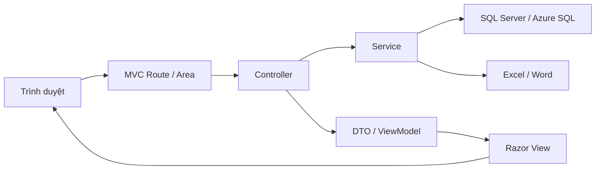

# Cấu trúc dự án và trách nhiệm file

Tài liệu này mô tả các folder/file chính của `HospitalQualityDashboard-demo`. Mục tiêu là giúp người mới biết nên đọc ở đâu, sửa file nào khi đổi nghiệp vụ và module nào chịu trách nhiệm cho từng luồng.

## 1. Tổng quan kiến trúc

- `Areas/Admin` và `Areas/User` tách giao diện theo vai trò.
- `Controllers` root xử lý đăng nhập, trang Home, base session/permission và endpoint bảo trì.
- `Services` chứa nghiệp vụ và truy cập database.
- `Models` chứa entity, enum, DTO và ViewModel.
- `App_Data/Sql` chứa schema/migration.
- `tools` chứa script verify phục vụ kiểm tra nhanh.

## 2. Cấp root repository

| Đường dẫn | Vai trò |
|---|---|
| `README.md` | Tài liệu vào dự án: mục tiêu, chức năng chính, setup, build, route và bảo mật. |
| `PROJECT_STRUCTURE.md` | File hiện tại, mô tả cấu trúc folder/file. |
| `HospitalQualityDashboard-demo.slnx` | Solution Visual Studio liên kết tới web project. |
| `HospitalQualityDashboard-demo/` | Web application ASP.NET MVC 4. |
| `packages/` | NuGet packages restore, không phải code nghiệp vụ. |

## 3. Cấu hình khởi động

| Đường dẫn | Vai trò |
|---|---|
| `HospitalQualityDashboard-demo/HospitalQualityDashboard-demo.csproj` | Project MVC 4 kiểu cũ; khai báo target .NET 4.7.2, reference, file compile/content và IIS Express. |
| `HospitalQualityDashboard-demo/Web.config` | Cấu hình MVC, session, culture `vi-VN`, binding redirect, connection string qua `configSource`, bootstrap DB và maintenance token. |
| `HospitalQualityDashboard-demo/Web.Debug.config` | Transform cho môi trường Debug. |
| `HospitalQualityDashboard-demo/Web.Release.config` | Transform Release, gồm thiết lập cookie HTTPS. |
| `HospitalQualityDashboard-demo/ConnectionStrings.example.config` | Mẫu connection string `HospitalQualityConnection`; copy thành `ConnectionStrings.config` khi chạy local. |
| `HospitalQualityDashboard-demo/Global.asax` | Chỉ thị ASP.NET trỏ tới `MvcApplication`. |
| `HospitalQualityDashboard-demo/Global.asax.cs` | `Application_Start`: đăng ký Area, filter, route, bundle và bootstrap DB nếu bật. |
| `HospitalQualityDashboard-demo/Properties/AssemblyInfo.cs` | Metadata assembly. |
| `HospitalQualityDashboard-demo/packages.config` | Danh sách NuGet package và version. |
| `HospitalQualityDashboard-demo/favicon.ico` | Icon trình duyệt. |

## 4. App_Start

| File | Vai trò |
|---|---|
| `App_Start/RouteConfig.cs` | Route MVC root, namespace controller root và fallback `Home.Index`. |
| `App_Start/FilterConfig.cs` | Global filter, hiện đăng ký `HandleErrorAttribute`. |
| `App_Start/BundleConfig.cs` | Bundle jQuery, validation, Modernizr, Bootstrap và CSS. |

## 5. SQL

| File | Vai trò |
|---|---|
| `App_Data/Sql/001_CreateSchema.sql` | Tạo schema fresh install: bảng lõi, khóa, default, seed ban đầu. |
| `App_Data/Sql/002_PerformanceIndexes.sql` | Index hiệu năng idempotent cho report, assignment, notification, employee và dashboard. |
| `App_Data/Sql/003_AddExportHistory.sql` | Tạo `LichSuXuatBaoCao` và index audit xuất Excel. |
| `App_Data/Sql/004_AddIndicatorWarning.sql` | Bổ sung liên kết thông báo với chỉ số và cơ chế chống gửi cảnh báo trùng. |
| `App_Data/Sql/005_AddIndicatorDeploymentHistory.sql` | Tạo `LichSuTrienKhaiChiSo` và `fn_ChiSoDuocTrienKhaiTrongKy`. |

## 6. Models

### Enums và Entities

| File | Vai trò |
|---|---|
| `Models/Enums/SystemEnums.cs` | Enum dùng chung: vai trò, loại công thức, tần suất, trạng thái kỳ/báo cáo, loại import/thông báo, kết quả cảnh báo chỉ số. |
| `Models/Entities/CoreEntities.cs` | POCO domain lõi: khoa/phòng, nhân viên, tài khoản, chỉ số, mục tiêu, phân công, kỳ, báo cáo, thông báo, import log, system log. |

### DTOs

| File | Vai trò |
|---|---|
| `Models/DTOs/AssignmentDtos.cs` | DTO preview, filter, command và bulk action phân công chỉ số. |
| `Models/DTOs/DepartmentDtos.cs` | DTO CRUD/import khoa/phòng. |
| `Models/DTOs/EmployeeDtos.cs` | DTO CRUD/import nhân viên, tạo tài khoản và cập nhật hồ sơ. |
| `Models/DTOs/ExportDtos.cs` | DTO filter/context/kết quả cho các luồng xuất Excel, Dashboard comparison/trend và audit. |
| `Models/DTOs/IndicatorDtos.cs` | DTO định nghĩa chỉ số, tần suất, mục tiêu, khoa thu thập/tổng hợp và import. |
| `Models/DTOs/NotificationDtos.cs` | DTO gửi/xem thông báo, người nhận, loại thông báo và dữ liệu thiếu báo cáo. |
| `Models/DTOs/ReportDtos.cs` | DTO filter báo cáo, header/detail lưu nháp/gửi và context Admin/User. |
| `Models/DTOs/ReportingPeriodDtos.cs` | DTO CRUD kỳ, sinh lịch, preview và automation kỳ báo cáo. |
| `Models/DTOs/SystemLogDtos.cs` | DTO filter/danh sách nhật ký hệ thống. |

### ViewModels

| File | Vai trò |
|---|---|
| `Models/ViewModels/AuthViewModels.cs` | ViewModel đăng nhập, đổi mật khẩu và hồ sơ cá nhân. |
| `Models/ViewModels/AppViewModels.cs` | ViewModel nghiệp vụ cho khoa/phòng, nhân viên, chỉ số, phân công, kỳ, báo cáo, thông báo, dashboard, export, comparison/trend và modal chi tiết. |

## 7. Services

### Infrastructure và Common

| File | Vai trò |
|---|---|
| `Services/Infrastructure/Database/DatabaseConfiguration.cs` | Đọc connection string chuẩn và báo lỗi sớm khi thiếu cấu hình. |
| `Services/Infrastructure/Database/DbServiceBase.cs` | Base ADO.NET: query, command, scalar, parameter, transaction, timeout và helper đọc kiểu nullable. |
| `Services/Infrastructure/Database/DatabaseBootstrapper.cs` | Chạy schema/migration/seed khi cấu hình bật bootstrap. |
| `Services/Infrastructure/Caching/DropdownCache.cs` | Cache dropdown trong `HttpRuntime.Cache`, có helper xóa cache sau CRUD/import. |
| `Services/Common/FrequencyHelper.cs` | Format, sắp xếp và tạo option tần suất báo cáo tiếng Việt. |

### Authentication

| File | Vai trò |
|---|---|
| `Services/Authentication/AuthService.cs` | Xác thực tài khoản, khóa tạm khi đăng nhập sai, tải lại session user, đổi mật khẩu, đọc/cập nhật hồ sơ. |
| `Services/Authentication/PasswordHasher.cs` | Hash/verify mật khẩu bằng PBKDF2 có salt và so sánh constant-time. |
| `Services/Authentication/SessionUserAccessor.cs` | Key session, đọc/ghi/xóa thông tin đăng nhập typed cho controller. |

### Danh mục và chỉ số

| File | Vai trò |
|---|---|
| `Services/Departments/DepartmentService.cs` | Tìm kiếm, phân trang, CRUD, khóa/mở, dropdown, import và export khoa/phòng. |
| `Services/Employees/EmployeeService.cs` | Tìm kiếm/phân trang, CRUD nhân viên, tạo tài khoản, kiểm tra username và import nhân viên. |
| `Services/Indicators/IndicatorService.cs` | API chính lấy danh sách/chi tiết/options, lưu/xóa/khóa chỉ số và kiểm tra phân công. |
| `Services/Indicators/IndicatorService.Persistence.cs` | Mapping record, parameter SQL và lưu chỉ số/mục tiêu trong transaction. |
| `Services/Indicators/IndicatorService.Frequencies.cs` | Đọc/ghi tần suất của chỉ số. |
| `Services/Indicators/IndicatorService.Departments.cs` | Đọc/ghi khoa thu thập/tổng hợp hoặc khoa liên quan tới chỉ số. |
| `Services/Indicators/IndicatorService.Formula.cs` | Chuẩn hóa và suy luận loại công thức chỉ số. |
| `Services/Indicators/IndicatorService.Parsing.cs` | Helper parse dữ liệu chỉ số từ file import. |
| `Services/Indicators/IndicatorService.Import.cs` | Import chỉ số từ Excel/Word và tạo dữ liệu liên quan. |
| `Services/Indicators/IndicatorService.Deployment.cs` | Triển khai/ngừng triển khai chỉ số, ghi lịch sử hiệu lực và system log. |
| `Services/Indicators/AssignmentService.cs` | API chính cho phân công chỉ số. |
| `Services/Indicators/AssignmentService.Queries.cs` | Query danh sách, preview và filter phân công. |
| `Services/Indicators/AssignmentService.Commands.cs` | Tạo, cập nhật, xóa, tạm dừng/kích hoạt và bulk action phân công. |
| `Services/Indicators/AssignmentService.Groups.cs` | Gom nhóm phân công theo khoa hoặc theo chỉ số cho UI. |

### Kỳ báo cáo, báo cáo, dashboard

| File | Vai trò |
|---|---|
| `Services/ReportingPeriods/ReportingPeriodService.cs` | CRUD, mở/khóa/xóa kỳ báo cáo và danh sách/filter kỳ. |
| `Services/ReportingPeriods/ReportingPeriodScheduleService.cs` | Sinh lịch kỳ báo cáo hàng loạt theo năm/tần suất/hạn nộp. |
| `Services/ReportingPeriods/ReportingPeriodMaintenanceService.cs` | Automation mở/khóa kỳ và phối hợp notification khi chạy bảo trì. |
| `Services/Reports/ReportService.cs` | Danh sách, nhập, lưu nháp, gửi, khóa, xóa và đọc chi tiết báo cáo. |
| `Services/Reports/IndicatorCalculationService.cs` | Tính giá trị/kết quả chỉ số theo loại công thức. |
| `Services/Dashboards/DashboardService.cs` | Entry Dashboard, áp scope role/khoa/tần suất và điều phối dữ liệu. |
| `Services/Dashboards/DashboardService.Summary.cs` | Query KPI tổng hợp, tiến độ khoa, tỷ lệ đạt và xếp loại. |
| `Services/Dashboards/DashboardService.Details.cs` | Chi tiết metric Dashboard theo kỳ/khoa/chỉ số. |
| `Services/Dashboards/DashboardService.MissingReports.cs` | Tìm báo cáo/chỉ số còn thiếu hoặc quá hạn. |
| `Services/Dashboards/DashboardService.Filters.cs` | Dựng filter option và áp filter/scope cho dashboard/export. |
| `Services/Dashboards/DashboardComparisonBuilder.cs` | Tính so sánh giá trị chỉ số nhiều kỳ, delta và xu hướng. |
| `Services/Dashboards/DashboardProgressComparisonBuilder.cs` | Phân loại tiến độ đúng hạn/trễ/chờ/quá hạn và tính thay đổi giữa kỳ. |
| `Services/Dashboards/DashboardProgressComparisonService.cs` | Query nhiều kỳ và tạo ViewModel comparison/trend cho Admin/User. |

### Export, Excel, notification, log

| File | Vai trò |
|---|---|
| `Services/Excel/ExcelWorksheetExport.cs` | Descriptor sheet/cột/items để tạo workbook. |
| `Services/Excel/ExcelImportExportService.cs` | API đọc CSV/XLSX/DOCX và tạo CSV/XLSX/workbook nhiều sheet. |
| `Services/Excel/ExcelImportExportService.Readers.cs` | Đọc CSV, XLSX shared string/cell và bảng Word; kiểm soát quoting, ô trống, zip ratio. |
| `Services/Excel/ExcelImportExportService.OpenXml.cs` | Tạo gói XLSX OpenXML, worksheet, relationship, cell và tên sheet an toàn. |
| `Services/Exports/ExportService.cs` | Xuất XLSX danh mục, báo cáo, phân công và Dashboard tiến độ. |
| `Services/Dashboards/Export/DashboardExcelExportService.cs` | Entry xuất Dashboard Excel chi tiết, chuẩn hóa scope/filter và điều phối sheet. |
| `Services/Dashboards/Export/DashboardExcelExportService.Queries.cs` | Query dữ liệu chi tiết, thiếu, lịch sử và tổng hợp khoa cho workbook. |
| `Services/Dashboards/Export/DashboardExcelExportService.Workbook.cs` | Tạo sheet ClosedXML, định dạng workbook và trạng thái. |
| `Services/Dashboards/Export/DashboardExcelExportService.Comparison.cs` | Tạo sheet so sánh/xu hướng nhiều kỳ trong Dashboard Excel. |
| `Services/Dashboards/Export/DashboardExcelExportService.History.cs` | Ghi lịch sử xuất, mô tả filter và tạo tên file an toàn. |
| `Services/Notifications/NotificationService.cs` | Danh sách, gửi thủ công, chi tiết, đánh dấu đã đọc và dữ liệu notification dropdown. |
| `Services/Notifications/NotificationAutomationService.cs` | Tạo thông báo mở kỳ, nhắc hạn, hạn hôm nay, quá hạn, tổng hợp Admin và dedup. |
| `Services/Notifications/IndicatorWarningMessageBuilder.cs` | Tạo nội dung tiếng Việt cho cảnh báo chỉ số chưa nộp. |
| `Services/SystemLogs/SystemLogService.cs` | Ghi và tra cứu nhật ký hệ thống. |

## 8. Controllers

### Root controllers

| File | Vai trò |
|---|---|
| `Controllers/HomeController.cs` | Trang vào công khai, điều hướng theo session. |
| `Controllers/AccountController.cs` | Đăng nhập Admin/User, logout, profile và đổi mật khẩu. |
| `Controllers/PageController.cs` | Base session guard, revalidate user và helper phân quyền/scope. |
| `Controllers/MaintenanceController.cs` | Endpoint bảo trì có token cho scheduler ngoài app chạy automation kỳ báo cáo. |

### Admin Area

| File | Vai trò |
|---|---|
| `Areas/Admin/AdminAreaRegistration.cs` | Đăng ký route Area Admin. |
| `Areas/Admin/Controllers/AdminBaseController.cs` | Base ép role Admin và dữ liệu layout Admin. |
| `Areas/Admin/Controllers/DashboardController.cs` | Dashboard toàn viện, drill-down, comparison/trend, cảnh báo chỉ số. |
| `Areas/Admin/Controllers/DepartmentController.cs` | CRUD/import/export khoa/phòng. |
| `Areas/Admin/Controllers/EmployeeController.cs` | CRUD/import nhân viên, tạo/khóa tài khoản. |
| `Areas/Admin/Controllers/IndicatorController.cs` | CRUD/import/detail/triển khai/ngừng triển khai chỉ số. |
| `Areas/Admin/Controllers/AssignmentController.cs` | Phân công chỉ số, preview, grouping, bulk action và export. |
| `Areas/Admin/Controllers/ReportingPeriodController.cs` | Kỳ báo cáo, chi tiết kỳ và sinh lịch tự động. |
| `Areas/Admin/Controllers/ReportController.cs` | Tra cứu, xem, khóa, xóa và export báo cáo toàn viện. |
| `Areas/Admin/Controllers/NotificationController.cs` | Hộp thư Admin, gửi thông báo và chạy automation. |
| `Areas/Admin/Controllers/ExportController.cs` | Endpoint tải Excel phía Admin. |
| `Areas/Admin/Controllers/SystemLogController.cs` | Màn hình tra cứu nhật ký hệ thống. |

### User Area

| File | Vai trò |
|---|---|
| `Areas/User/UserAreaRegistration.cs` | Đăng ký route Area User. |
| `Areas/User/Controllers/UserBaseController.cs` | Base ép role User, khoa hiện tại và badge thông báo. |
| `Areas/User/Controllers/DashboardController.cs` | Dashboard khoa/phòng, comparison/trend và export theo scope User. |
| `Areas/User/Controllers/IndicatorController.cs` | Danh sách/chi tiết chỉ số được giao. |
| `Areas/User/Controllers/ReportController.cs` | Kỳ mở, nhập, lưu nháp, gửi và xem báo cáo của khoa. |
| `Areas/User/Controllers/NotificationController.cs` | Hộp thư User, chi tiết, thiếu báo cáo và đánh dấu đã đọc. |
| `Areas/User/Controllers/ExportController.cs` | Endpoint tải Excel theo scope khoa/phòng. |

## 9. Razor Views

### Root views và partial dùng chung

| File | Vai trò |
|---|---|
| `Views/_ViewStart.cshtml` | Chọn layout root. |
| `Views/Web.config` | Cấu hình Razor cho root views và chặn truy cập trực tiếp `.cshtml`. |
| `Views/Home/Index.cshtml` | Trang chọn đăng nhập hoặc điều hướng dashboard theo session. |
| `Views/Account/AdminLogin.cshtml` | Form đăng nhập Admin. |
| `Views/Account/UserLogin.cshtml` | Form đăng nhập User. |
| `Views/Account/Profile.cshtml` | Hồ sơ cá nhân và đổi mật khẩu. |
| `Views/Shared/_Layout.cshtml` | Layout chính, menu, topbar, bundles và notification dropdown. |
| `Views/Shared/_DashboardComparison.cshtml` | Partial filter/bảng/chart so sánh nhiều kỳ. |
| `Views/Shared/_ReportDetailModal.cshtml` | Modal xem chi tiết báo cáo dùng chung. |
| `Views/Shared/Error.cshtml` | Trang lỗi MVC. |

### Admin views

| File | Vai trò |
|---|---|
| `Areas/Admin/Views/_ViewStart.cshtml` | Chọn layout Admin. |
| `Areas/Admin/Views/Web.config` | Cấu hình Razor cho Admin views. |
| `Areas/Admin/Views/Shared/_AdminLayout.cshtml` | Wrapper layout Admin. |
| `Areas/Admin/Views/Dashboard/Index.cshtml` | Dashboard Admin: KPI, drill-down, thiếu/quá hạn, comparison/trend, export. |
| `Areas/Admin/Views/Dashboard/PeriodComparison.cshtml` | View/partial so sánh kỳ báo cáo phía Admin. |
| `Areas/Admin/Views/Department/Index.cshtml` | Danh sách, filter, import/export và thao tác khoa/phòng. |
| `Areas/Admin/Views/Department/Edit.cshtml` | Form tạo/sửa khoa/phòng. |
| `Areas/Admin/Views/Employee/Index.cshtml` | Danh sách nhân viên, filter, phân trang, import/export, tạo tài khoản. |
| `Areas/Admin/Views/Employee/Edit.cshtml` | Form tạo/sửa nhân viên. |
| `Areas/Admin/Views/Employee/CreateAccount.cshtml` | Form tạo tài khoản cho nhân viên. |
| `Areas/Admin/Views/Indicator/Index.cshtml` | Danh sách chỉ số, filter, import/export, triển khai/ngừng triển khai. |
| `Areas/Admin/Views/Indicator/Edit.cshtml` | Form định nghĩa chỉ số, tần suất, công thức, mục tiêu và khoa liên quan. |
| `Areas/Admin/Views/Indicator/Details.cshtml` | Chi tiết readonly chỉ số. |
| `Areas/Admin/Views/Assignment/Index.cshtml` | Màn hình phân công, filter, preview, grouping, bulk action và export. |
| `Areas/Admin/Views/Assignment/_DepartmentView.cshtml` | Partial nhóm phân công theo khoa/phòng. |
| `Areas/Admin/Views/Assignment/_IndicatorView.cshtml` | Partial nhóm phân công theo chỉ số. |
| `Areas/Admin/Views/Assignment/_TableView.cshtml` | Partial bảng phân công phẳng. |
| `Areas/Admin/Views/ReportingPeriod/Index.cshtml` | Danh sách kỳ, mở/khóa/xóa và link sinh lịch. |
| `Areas/Admin/Views/ReportingPeriod/Edit.cshtml` | Form tạo/sửa kỳ báo cáo. |
| `Areas/Admin/Views/ReportingPeriod/Details.cshtml` | Chi tiết kỳ, thống kê và chỉ số áp dụng. |
| `Areas/Admin/Views/ReportingPeriod/GenerateSchedule.cshtml` | Preview và xác nhận sinh lịch kỳ tự động. |
| `Areas/Admin/Views/Report/Index.cshtml` | Tra cứu/export báo cáo toàn viện. |
| `Areas/Admin/Views/Report/Edit.cshtml` | Xem chi tiết báo cáo readonly. |
| `Areas/Admin/Views/Report/Nhap.cshtml` | View nhập báo cáo cũ phía Admin, không phải luồng chính. |
| `Areas/Admin/Views/Notification/Index.cshtml` | Hộp thư Admin, automation và phân trang. |
| `Areas/Admin/Views/Notification/Create.cshtml` | Form gửi thông báo tới nhiều khoa/phòng. |
| `Areas/Admin/Views/Notification/Details.cshtml` | Chi tiết thông báo Admin. |
| `Areas/Admin/Views/SystemLog/Index.cshtml` | Tra cứu nhật ký hệ thống. |

### User views

| File | Vai trò |
|---|---|
| `Areas/User/Views/_ViewStart.cshtml` | Chọn layout User. |
| `Areas/User/Views/Web.config` | Cấu hình Razor cho User views. |
| `Areas/User/Views/Shared/_UserLayout.cshtml` | Wrapper layout User. |
| `Areas/User/Views/Dashboard/Index.cshtml` | Dashboard khoa/phòng, KPI, comparison/trend và export theo scope khoa. |
| `Areas/User/Views/Indicator/Index.cshtml` | Danh sách chỉ số được giao cho khoa. |
| `Areas/User/Views/Indicator/Details.cshtml` | Chi tiết readonly chỉ số được giao. |
| `Areas/User/Views/Report/Index.cshtml` | Kỳ mở và lịch sử báo cáo của khoa. |
| `Areas/User/Views/Report/Nhap.cshtml` | Danh sách chỉ số cần nhập trong kỳ. |
| `Areas/User/Views/Report/Edit.cshtml` | Form nhập, lưu nháp và gửi báo cáo. |
| `Areas/User/Views/Notification/Index.cshtml` | Hộp thư User và đánh dấu đã đọc. |
| `Areas/User/Views/Notification/Details.cshtml` | Chi tiết thông báo User và link báo cáo còn thiếu. |

## 10. Frontend và tài nguyên tĩnh

| Đường dẫn | Vai trò |
|---|---|
| `Content/Site.css` | CSS tự viết cho layout, dashboard, form, bảng, notification và responsive. |
| `Content/images/logo-ungbuou.png` | Logo dùng trong giao diện. |
| `Content/images/bg-ungbuu.png` | Ảnh nền/trang đăng nhập hoặc landing. |
| `Content/bootstrap*.css`, `Scripts/bootstrap*.js` | Bootstrap vendor từ NuGet. |
| `Scripts/jquery-3.7.0*`, `Scripts/jquery.validate*` | jQuery và validation vendor. |
| `Scripts/modernizr-2.8.3.js` | Modernizr vendor. |
| `Scripts/date-input.js` | JavaScript định dạng ngày `dd/MM/yyyy` và mở date picker qua icon lịch. |
| `Scripts/dashboard-analysis.js` | JavaScript tự viết cho dashboard comparison/trend, fetch partial và render chart. |
| `Scripts/*.map`, `Content/*.map` | Source map vendor. |

## 11. Tài liệu nghiệp vụ

| Đường dẫn | Vai trò |
|---|---|
| `HospitalQualityDashboard-demo/PROJECT_CONTEXT.md` | Bối cảnh nghiệp vụ/kỹ thuật, kiến trúc, module, rủi ro vận hành. |
| `HospitalQualityDashboard-demo/AGENTS.md` | Quy ước làm việc, build, test, bảo mật và cập nhật tài liệu. |
| `HospitalQualityDashboard-demo/TAI_LIEU_NGHIEP_VU.md` | Tài liệu nghiệp vụ chi tiết. |
| `HospitalQualityDashboard-demo/implementation-notes.md` | Nhật ký thay đổi kỹ thuật theo thời gian. |
| `HospitalQualityDashboard-demo/Tai_Lieu/Phan Tich Thiet Ke He Thong Chi Tiet.md` | Phân tích thiết kế hệ thống chi tiết. |
| `HospitalQualityDashboard-demo/Tai_Lieu/Lỗ hổng.md` | Ghi chú/rà soát rủi ro bảo mật. |
| `HospitalQualityDashboard-demo/Tai_Lieu/*.xlsx`, `*.docx` | File mẫu import và tài liệu nguồn nghiệp vụ. |

## 12. PowerShell tools

| File | Vai trò |
|---|---|
| `tools/ServiceSourceReader.ps1` | Helper đọc/ghép source cho verifier. |
| `tools/GetServicePublicApi.ps1` | Reflection public API của namespace Services từ DLL build. |
| `tools/VerifyDashboardAdminSummary.ps1` | Kiểm contract KPI Dashboard Admin. |
| `tools/VerifyDashboardExcelDetailedExport.ps1` | Kiểm workbook Dashboard Excel chi tiết. |
| `tools/VerifyDashboardExcelUpgrade.ps1` | Kiểm code path nâng cấp Dashboard Excel. |
| `tools/VerifyDashboardMetricDetails.ps1` | Kiểm modal/query/CSS chi tiết metric Dashboard. |
| `tools/VerifyDashboardPeriodComparison.ps1` | Kiểm builder và integration so sánh nhiều kỳ. |
| `tools/VerifyDashboardSimpleCards.ps1` | Kiểm thẻ Dashboard đơn giản và dữ liệu hiển thị. |
| `tools/VerifyEmployeeOrder.ps1` | Kiểm thứ tự nhân viên và số thứ tự xuyên trang. |
| `tools/VerifyIndicatorDeploymentLifecycle.ps1` | Kiểm vòng đời triển khai/ngừng triển khai chỉ số. |
| `tools/VerifyIndicatorWarningMessages.ps1` | Kiểm nội dung Unicode của cảnh báo chỉ số. |
| `tools/VerifyIndicatorWarnings.ps1` | Kiểm migration, automation, dedup và UI cảnh báo chỉ số. |
| `tools/VerifyManagementPaging.ps1` | Kiểm phân trang quản lý kỳ, chỉ số và notification. |
| `tools/VerifyNotificationDropdown.ps1` | Kiểm dropdown thông báo trên layout. |
| `tools/VerifyProfileUpdate.ps1` | Kiểm form cập nhật hồ sơ cá nhân. |
| `tools/VerifyReportDetailModal.ps1` | Kiểm modal chi tiết báo cáo. |
| `tools/VerifyReportingPeriodMaintenance.ps1` | Kiểm bảo trì kỳ báo cáo, notification automation và endpoint liên quan. |
| `tools/VerifyReportResultAndExcelTime.ps1` | Kiểm kết quả báo cáo, làm tròn và thời gian Excel/audit. |
| `tools/VerifyReportSubmissionNavigationAndAdminAudit.ps1` | Kiểm điều hướng sau gửi báo cáo và audit Admin. |
| `tools/VerifySidebarNavigationGroups.ps1` | Kiểm nhóm điều hướng sidebar. |
| `tools/VerifySqlMigrations.ps1` | Kiểm chất lượng/idempotency migration SQL. |
| `tools/VerifySystemLogPage.ps1` | Kiểm trang nhật ký hệ thống. |
| `tools/VerifyUnreadNotificationBadge.ps1` | Kiểm badge thông báo chưa đọc và mark-as-read. |
| `tools/VerifyUserReportLockedReturnMessage.ps1` | Kiểm thông báo khi User quay lại báo cáo đã khóa/trả lại. |

## 13. Bản đồ sửa nhanh theo yêu cầu

| Muốn sửa | Bắt đầu từ |
|---|---|
| Đăng nhập, session, phân quyền | `AccountController`, `PageController`, `AuthService`, `SessionUserAccessor` |
| Khoa/phòng | `DepartmentController`, `DepartmentService`, `DepartmentDtos`, views `Department/*` |
| Nhân viên/tài khoản User | `EmployeeController`, `EmployeeService`, `EmployeeDtos`, views `Employee/*` |
| Chỉ số và import chỉ số | `IndicatorController`, `IndicatorService.*`, `IndicatorDtos`, views `Indicator/*` |
| Triển khai/ngừng triển khai chỉ số | `IndicatorService.Deployment.cs`, SQL `005`, verify deployment lifecycle |
| Phân công chỉ số | `AssignmentController`, `AssignmentService.*`, views `Assignment/*` |
| Kỳ báo cáo | `ReportingPeriodController`, `ReportingPeriodService`, `ReportingPeriodScheduleService`, views `ReportingPeriod/*` |
| Automation kỳ/nhắc hạn | `ReportingPeriodMaintenanceService`, `NotificationAutomationService`, `MaintenanceController` |
| User nhập/gửi báo cáo | `Areas/User/Controllers/ReportController.cs`, `ReportService`, views `User/Report/*` |
| Admin xem/khóa/xóa báo cáo | `Areas/Admin/Controllers/ReportController.cs`, `ReportService`, views `Admin/Report/*` |
| Dashboard | `DashboardController`, `DashboardService.*`, shared partials, `dashboard-analysis.js` |
| Export Excel | `ExportController`, `ExportService`, `DashboardExcelExportService.*`, `ExcelImportExportService.*` |
| Notification | `NotificationController`, `NotificationService`, `NotificationAutomationService`, layout dropdown |
| System log | `SystemLogController`, `SystemLogService`, `SystemLogDtos`, view `SystemLog/Index.cshtml` |
| CSS/UI layout | `Content/Site.css`, layouts `_Layout`, `_AdminLayout`, `_UserLayout` |
| SQL schema/migration | `App_Data/Sql/*.sql`, `DatabaseBootstrapper` |

## 14. Quy tắc cập nhật tài liệu

- Thêm/đổi/xóa file tự viết: cập nhật tài liệu này.
- Thay đổi cách setup, chạy, route, tính năng chính hoặc bảo mật: cập nhật `README.md`.
- Thay đổi kiến trúc, scope dữ liệu, module nghiệp vụ, database hoặc vận hành: cập nhật `PROJECT_CONTEXT.md`.
- Thay đổi quy ước code/build/test/secret: cập nhật `HospitalQualityDashboard-demo/AGENTS.md`.
- Thay đổi rule nghiệp vụ chi tiết: cập nhật `TAI_LIEU_NGHIEP_VU.md` hoặc tài liệu trong `Tai_Lieu/`.
