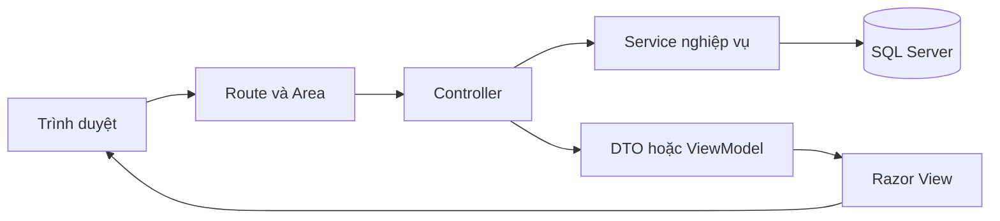

# Cấu trúc và chức năng mã nguồn

Tài liệu này giải thích kiến trúc, chức năng của từng thư mục và từng file mã
nguồn do dự án tự viết. Đối tượng đọc chính là thành viên mới cần biết nên bắt
đầu từ đâu, một request đi qua những lớp nào và phải sửa file nào khi thay đổi
nghiệp vụ.

## Mục lục

1. [Tổng quan kiến trúc](#1-tổng-quan-kiến-trúc)
2. [Cấu trúc repository](#2-cấu-trúc-repository)
3. [Khởi động và cấu hình](#3-khởi-động-và-cấu-hình)
4. [Models](#4-models)
5. [Services](#5-services)
6. [Controllers và Razor Views](#6-controllers-và-razor-views)
7. [Frontend tự viết](#7-frontend-tự-viết)
8. [SQL](#8-sql)
9. [PowerShell tools](#9-powershell-tools)
10. [Luồng nghiệp vụ xuyên module](#10-luồng-nghiệp-vụ-xuyên-module)
11. [Bản đồ tìm nơi cần sửa](#11-bản-đồ-tìm-nơi-cần-sửa)
12. [Quy tắc cập nhật tài liệu](#12-quy-tắc-cập-nhật-tài-liệu)
13. [Phụ lục: danh mục đầy đủ file code](#13-phụ-lục-danh-mục-đầy-đủ-file-code)

## 1. Tổng quan kiến trúc

Đây là ASP.NET MVC 4 Web Application chạy trên .NET Framework 4.7.2. Dự án
không dùng ORM; các service truy cập SQL Server/Azure SQL bằng ADO.NET. Admin
và User được tách thành hai MVC Area, nhưng dùng chung Models, Services, layout
gốc và các partial Dashboard.



Vai trò của các loại model:

- **Entity** mô tả khái niệm và cột dữ liệu lõi.
- **DTO** là hợp đồng truyền lệnh/bộ lọc giữa Controller và Service.
- **ViewModel** chứa dữ liệu nhập hoặc hiển thị của một màn hình Razor.
- **Service** thực hiện nghiệp vụ, phân vùng dữ liệu và truy cập database.
- **Controller** xác thực request, ánh xạ DTO/ViewModel và chọn View/response.
- **Razor View** chỉ hiển thị và thu thập dữ liệu; phân quyền thật phải được
  thực thi ở Controller và Service.

## 2. Cấu trúc repository

```text
HospitalQualityDashboard-demo/
├── HospitalQualityDashboard-demo.slnx     Solution Visual Studio
├── README.md                              Hướng dẫn cài đặt và vận hành
├── PROJECT_STRUCTURE.md                   Tài liệu đang đọc
├── packages/                              NuGet restore, không phải code dự án
└── HospitalQualityDashboard-demo/
    ├── App_Start/                         Đăng ký route, filter và bundle
    ├── App_Data/Sql/                      Schema và migration SQL
    ├── Areas/Admin/                       Giao diện và endpoint quản trị
    ├── Areas/User/                        Giao diện và endpoint khoa/phòng
    ├── Content/                           CSS
    ├── Controllers/                       Trang công khai và tài khoản
    ├── Models/                            Entity, enum, DTO và ViewModel
    ├── Scripts/                           JavaScript ứng dụng và thư viện
    ├── Services/                          Nghiệp vụ và truy cập dữ liệu
    ├── Tai_Lieu/                          Tài liệu phân tích và file mẫu
    ├── tools/                             Script kiểm tra cấu trúc/hành vi
    └── Views/                             View gốc và partial dùng chung
```

Các thư mục `.git`, `.vs`, `bin`, `obj` và `packages` là metadata hoặc sản phẩm
sinh tự động, không phải nơi sửa nghiệp vụ.

### Tài liệu và thư mục hỗ trợ

- **`README.md`**: điểm vào cho người phát triển và vận hành; hướng dẫn công
  nghệ, cài đặt, connection string, build/run, chức năng, bảo mật và verifier.
- **`PROJECT_STRUCTURE.md`**: tài liệu tra cứu cấu trúc và trách nhiệm từng file;
  phải được cập nhật khi code được thêm, đổi tên, di chuyển hoặc xóa.
- **`HospitalQualityDashboard-demo/AGENTS.md`**: quy tắc làm việc trong repo,
  lệnh build/test, coding convention và yêu cầu bảo mật cấu hình.
- **`HospitalQualityDashboard-demo/PROJECT_CONTEXT.md`**: bối cảnh kiến trúc,
  kỹ thuật và nghiệp vụ hiện tại; dùng để định hướng trước khi sửa module lớn.
- **`HospitalQualityDashboard-demo/TAI_LIEU_NGHIEP_VU.md`**: nguồn tổng hợp quy
  tắc business, vai trò, kỳ, báo cáo, công thức, dashboard và import/export.
- **`HospitalQualityDashboard-demo/implementation-notes.md`**: nhật ký triển
  khai theo ngày; giải thích lý do và phạm vi thay đổi nhưng không thay thế tài
  liệu hiện trạng.
- **`HospitalQualityDashboard-demo/Tai_Lieu/`**: tài liệu BA/SDD, báo cáo rà
  soát bảo mật và file Word/Excel mẫu. `Phan Tich Thiet Ke He Thong Chi Tiet.md`
  mô tả thiết kế chi tiết; `Lỗ hổng.md` là snapshot bảo mật cần tái xác minh;
  các file bảng tính/tài liệu còn lại là dữ liệu nguồn hoặc mẫu import, không
  phải cấu hình runtime.

## 3. Khởi động và cấu hình

### `HospitalQualityDashboard-demo.slnx`

Solution XML mới của Visual Studio, liên kết đến web project. Mở file này để
Visual Studio tải đầy đủ project.

### `HospitalQualityDashboard-demo/HospitalQualityDashboard-demo.csproj`

Khai báo web project MVC 4, .NET Framework 4.7.2, IIS Express HTTPS cổng 44387,
reference NuGet và danh sách file được compile/đóng gói. Project kiểu cũ yêu
cầu file mới phải có `Compile`, `Content` hoặc `None`; `MvcBuildViews` mặc định
tắt nên build thường không kiểm tra toàn bộ Razor.

### `HospitalQualityDashboard-demo/App_Start`

Chứa cấu hình được gọi một lần khi ứng dụng khởi động.

- **`App_Start/RouteConfig.cs`**: bỏ qua route `.axd`, đăng ký route gốc
  `{controller}/{action}/{id}` về `Home.Index` và giới hạn namespace controller
  gốc. Route của Area được đăng ký trước nên có ưu tiên.
- **`App_Start/FilterConfig.cs`**: đăng ký global `HandleErrorAttribute`. File
  không đăng ký authorization toàn cục; quyền được kiểm tại base controller.
- **`App_Start/BundleConfig.cs`**: đăng ký bundle jQuery, validation,
  Modernizr, Bootstrap và CSS dùng trong `_Layout.cshtml`.

### Điểm vào ứng dụng

- **`HospitalQualityDashboard-demo/Global.asax`**: chỉ thị ASP.NET ánh xạ ứng
  dụng đến `HospitalQualityDashboardDemo.MvcApplication`.
- **`HospitalQualityDashboard-demo/Global.asax.cs`**: `Application_Start()`
  đăng ký Area, filter, route, bundle rồi gọi bootstrap database nếu được bật
  rõ ràng trong cấu hình.
- **`HospitalQualityDashboard-demo/Properties/AssemblyInfo.cs`**: metadata
  assembly, COM visibility, GUID và version `1.0.0.0`.

### Cấu hình web và dependency

- **`HospitalQualityDashboard-demo/Web.config`**: cấu hình MVC/.NET 4.7.2,
  culture `vi-VN`, session 30 phút, cookie HttpOnly/SameSite, binding redirect,
  CodeDom và connection string ngoài file qua `configSource`. Bootstrap DB mặc
  định tắt. Base config vẫn `debug=true` và `requireSSL=false`, không dùng trực
  tiếp cho production.
- **`HospitalQualityDashboard-demo/Web.Debug.config`**: XDT transform giữ chế
  độ debug cho môi trường phát triển.
- **`HospitalQualityDashboard-demo/Web.Release.config`**: xóa `debug`, ép
  cookie HTTPS; chỉ có hiệu lực khi pipeline publish áp dụng transform.
- **`HospitalQualityDashboard-demo/ConnectionStrings.example.config`**: mẫu
  connection string `HospitalQualityConnection`. Sao chép thành
  `ConnectionStrings.config`, thay placeholder và không commit credential.
- **`HospitalQualityDashboard-demo/packages.config`**: danh sách/version NuGet:
  MVC/Razor, jQuery/Bootstrap, Newtonsoft.Json, ClosedXML và OpenXML.
- **`HospitalQualityDashboard-demo/Areas/Admin/Views/Web.config`**,
  **`Areas/User/Views/Web.config`** và **`Views/Web.config`**: cấu hình Razor
  MVC 4, import namespace và chặn truy cập trực tiếp file `.cshtml`.

## 4. Models

### `HospitalQualityDashboard-demo/Models/Enums`

Folder chứa mã trạng thái dùng chung giữa UI, service và database.

- **`Models/Enums/SystemEnums.cs`**: khai báo loại tài khoản, loại công thức,
  tần suất báo cáo, trạng thái kỳ/báo cáo, loại import/thông báo và kết quả gửi
  cảnh báo. Khi đổi enum phải rà SQL, dropdown và logic format tương ứng.

### `HospitalQualityDashboard-demo/Models/Entities`

Folder mô tả domain và schema lõi. Ứng dụng dùng ADO.NET thay vì ORM nên entity
chủ yếu là POCO phản ánh dữ liệu.

- **`Models/Entities/CoreEntities.cs`**: chứa `KhoaPhong`, `NhanVien`,
  `TaiKhoan`, `ChiSoChatLuong`, `ChiSoMucTieu`, `PhanCongChiSo`, `KyBaoCao`,
  `BaoCao`, `BaoCaoChiTiet`, `ThongBao`, `ThongBaoNguoiNhan`, `LichSuImport` và
  `NhatKyHeThong`; constructor đặt trạng thái/thời gian mặc định.

### `HospitalQualityDashboard-demo/Models/DTOs`

Folder DTO chứa hợp đồng dữ liệu giữa Controller và Service, giúp Service không
phụ thuộc trực tiếp vào form Razor.

- **`Models/DTOs/AssignmentDtos.cs`**: dữ liệu preview, truy vấn, lệnh tạo và
  thao tác hàng loạt phân công chỉ số; dùng bởi `AssignmentController` và
  `AssignmentService`.
- **`Models/DTOs/DepartmentDtos.cs`**: `DepartmentSaveDto` cho CRUD và
  `DepartmentImportDto` cho file import khoa/phòng; đầu vào của
  `DepartmentService`.
- **`Models/DTOs/EmployeeDtos.cs`**: dữ liệu lưu nhân viên, tạo tài khoản,
  import và cập nhật hồ sơ; dùng bởi `EmployeeService`, `AuthService` và các
  controller tài khoản/nhân viên.
- **`Models/DTOs/ExportDtos.cs`**: toàn bộ filter/ngữ cảnh xuất Excel, truy vấn
  dashboard so sánh/xu hướng, dữ liệu chỉ số theo kỳ và kết quả file. DTO
  `ExportUserContextDto` mang role/khoa/IP để khóa phạm vi và ghi audit.
- **`Models/DTOs/IndicatorDtos.cs`**: định nghĩa đầy đủ chỉ số, nhiều tần suất,
  khoa thu thập/tổng hợp, mục tiêu và file import; đầu vào `IndicatorService`.
- **`Models/DTOs/NotificationDtos.cs`**: tiêu đề, nội dung, loại, kỳ/chỉ số liên
  quan và danh sách khoa nhận; đầu vào gửi thông báo thủ công.
- **`Models/DTOs/ReportDtos.cs`**: filter danh sách báo cáo có cờ Admin và khoa
  hiện tại; dữ liệu lưu nháp header/detail. Service tự tính kết quả thay vì tin
  giá trị từ client.
- **`Models/DTOs/ReportingPeriodDtos.cs`**: dữ liệu CRUD kỳ và sinh lịch hàng
  loạt theo năm/tần suất/hạn nộp/trạng thái.

### `HospitalQualityDashboard-demo/Models/ViewModels`

Folder ViewModel chứa dữ liệu form và màn hình Razor, bao gồm validation bằng
DataAnnotations và danh sách lựa chọn.

- **`Models/ViewModels/AuthViewModels.cs`**: `LoginViewModel`,
  `ChangePasswordViewModel`, `UserProfileViewModel`; dùng cho đăng nhập, đổi
  mật khẩu và hồ sơ cá nhân.
- **`Models/ViewModels/AppViewModels.cs`**: tập hợp ViewModel nghiệp vụ cho
  khoa/phòng, nhân viên, chỉ số, phân công, kỳ, báo cáo, thông báo, dashboard,
  import và export. File cũng chứa các model so sánh/xu hướng, chi tiết metric,
  báo cáo thiếu và kết quả sinh lịch; được dùng bởi hầu hết Controller/View.

## 5. Services

Service chứa nghiệp vụ có thể tái sử dụng. Những class `partial` được tách theo
trách nhiệm để giảm kích thước file nhưng khi compile vẫn là một class.

### `Services/Infrastructure/Database`

- **`Services/Infrastructure/Database/DatabaseConfiguration.cs`**: đọc
  connection string theo tên chuẩn và dừng sớm nếu thiếu cấu hình.
- **`Services/Infrastructure/Database/DbServiceBase.cs`**: base ADO.NET với
  `Query`, `QuerySingle`, `Execute`, `Scalar`, transaction, parameter và helper
  đọc kiểu nullable; phần lớn service database kế thừa file này.
- **`Services/Infrastructure/Database/DatabaseBootstrapper.cs`**: khi được bật
  rõ ràng, tạo database/schema, chạy script theo batch `GO`, seed Admin và kiểm
  tra object. Được gọi từ `Application_Start`; không nên bật tùy tiện production.

### `Services/Infrastructure/Caching`

- **`Services/Infrastructure/Caching/DropdownCache.cs`**: cache dropdown trong
  `HttpRuntime.Cache`, cung cấp `GetOrAdd` và `Remove`; service xóa cache sau
  CRUD để tránh dữ liệu cũ.

### `Services/Authentication`

- **`Services/Authentication/PasswordHasher.cs`**: hash/verify mật khẩu bằng
  PBKDF2 có salt và so sánh constant-time.
- **`Services/Authentication/SessionUserAccessor.cs`**: định nghĩa key session,
  đọc giá trị typed, ghi phiên đăng nhập và xóa phiên; hỗ trợ cả session thật
  và `HttpSessionStateBase` để Controller dùng.
- **`Services/Authentication/AuthService.cs`**: xác thực tài khoản, khóa tạm do
  đăng nhập sai, tải lại user cho session, cập nhật lần đăng nhập, đổi mật khẩu,
  lấy/cập nhật hồ sơ. Chứa model `AuthenticatedUser`; dùng bởi
  `AccountController` và `PageController`.

### `Services/Common`

- **`Services/Common/FrequencyHelper.cs`**: định dạng, sắp xếp và tạo option
  dropdown tần suất báo cáo bằng nhãn tiếng Việt.

### `Services/Excel`

- **`Services/Excel/ExcelWorksheetExport.cs`**: descriptor tên sheet, items và
  cột; chuyển danh sách typed thành cấu trúc chung cho workbook.
- **`Services/Excel/ExcelImportExportService.cs`**: API công khai đọc
  CSV/XLSX/DOCX và tạo CSV/XLSX/workbook nhiều sheet; kiểm soát kích thước file,
  dòng và ZIP ratio.
- **`Services/Excel/ExcelImportExportService.Readers.cs`**: phần partial đọc
  CSV, cell/shared string XLSX và bảng Word; xử lý quoting, ô trống và bảo vệ
  formula injection/zip bomb.
- **`Services/Excel/ExcelImportExportService.OpenXml.cs`**: phần partial tạo gói
  XLSX OpenXML, worksheet, relationship, cell; chuẩn hóa tên sheet và XML.

### `Services/Departments` và `Services/Employees`

- **`Services/Departments/DepartmentService.cs`**: tìm kiếm, CRUD, khóa/mở,
  dropdown và import khoa/phòng; dùng Excel service, cache và ghi lịch sử import.
- **`Services/Employees/EmployeeService.cs`**: danh sách/phân trang, CRUD nhân
  viên, tạo tài khoản, kiểm tra username và import. Import có thể tạo tài khoản
  mặc định đã hash cho nhân viên.

### `Services/Indicators`

`IndicatorService` quản lý định nghĩa chỉ số; `AssignmentService` quản lý quan
hệ nhiều-nhiều giữa chỉ số và khoa/phòng.

- **`Services/Indicators/IndicatorService.cs`**: API chính lấy danh sách/chi
  tiết/options, kiểm tra phân công, lưu, khóa và xóa chỉ số.
- **`Services/Indicators/IndicatorService.Persistence.cs`**: ánh xạ record,
  tạo SQL parameters và lưu mục tiêu/chỉ số trong transaction.
- **`Services/Indicators/IndicatorService.Deployment.cs`**: vòng đời triển khai
  chỉ số; `Deploy` mở lịch sử áp dụng theo tần suất, `StopDeployment` đóng lịch
  sử hiện hành theo ngày Việt Nam, ghi `NhatKyHeThong` và xóa cache dropdown.
- **`Services/Indicators/IndicatorService.Frequencies.cs`**: đọc/lưu quan hệ
  nhiều tần suất, parse các biến thể nhãn và áp selection vào ViewModel.
- **`Services/Indicators/IndicatorService.Departments.cs`**: phân giải tên/alias
  khoa thu thập và tổng hợp khi import; cung cấp lookup dùng lại khi đồng bộ
  phân công.
- **`Services/Indicators/IndicatorService.Formula.cs`**: suy luận loại công
  thức, đơn vị và mục tiêu từ văn bản nguồn.
- **`Services/Indicators/IndicatorService.Parsing.cs`**: helper đọc row import,
  chuẩn hóa header và parse số, bool, năm, mục tiêu nullable.
- **`Services/Indicators/IndicatorService.Import.cs`**: điều phối import
  CSV/XLSX/DOCX, validate từng dòng, resolve khoa, lưu chỉ số/tần suất/mục tiêu/
  phân công trong transaction và trả kết quả lỗi/thành công.
- **`Services/Indicators/AssignmentService.cs`**: class partial gốc, cung cấp
  helper định dạng tần suất/công thức.
- **`Services/Indicators/AssignmentService.Queries.cs`**: truy vấn bảng phẳng,
  đếm, phân trang và tạo dòng export theo filter.
- **`Services/Indicators/AssignmentService.Groups.cs`**: tạo view nhóm theo
  khoa hoặc chỉ số và tính thống kê phân công.
- **`Services/Indicators/AssignmentService.Commands.cs`**: preview tích
  khoa-chỉ số, tạo/kích hoạt lại, đồng bộ từ nguồn chỉ số, bật/tắt/xóa đơn lẻ và
  hàng loạt.

### `Services/ReportingPeriods` và `Services/Reports`

- **`Services/ReportingPeriods/ReportingPeriodService.cs`**: danh sách,
  dropdown, kiểm tra kỳ mở cho khoa, CRUD và chuyển trạng thái kỳ báo cáo.
- **`Services/ReportingPeriods/ReportingPeriodScheduleService.cs`**: tạo request
  mặc định, preview khoảng thời gian, sinh lịch theo tần suất, chống trùng, mở
  kỳ đến hạn và khóa kỳ quá hạn.
- **`Services/ReportingPeriods/ReportingPeriodMaintenanceService.cs`**: điều
  phối bảo trì kỳ báo cáo: mở kỳ đến hạn, chạy notification automation rồi khóa
  kỳ quá hạn.
- **`Services/Reports/IndicatorCalculationService.cs`**: tính `KetQua`, đánh giá
  mục tiêu, làm tròn và validate tử số/mẫu số theo loại công thức.
- **`Services/Reports/ReportService.cs`**: truy vấn có khóa phạm vi khoa, lấy chỉ
  số được giao, lưu nháp trong transaction, tính lại server-side, gửi, khóa,
  xóa, snapshot chi tiết và ghi audit.

### `Services/Notifications`

- **`Services/Notifications/IndicatorWarningMessageBuilder.cs`**: tạo tiêu đề,
  nội dung và loại thông báo cho trước hạn, đúng hạn hoặc quá hạn.
- **`Services/Notifications/NotificationService.cs`**: đếm chưa đọc, hộp thư
  theo user, chi tiết, gửi thủ công và đánh dấu đã đọc.
- **`Services/Notifications/NotificationAutomationService.cs`**: mở kỳ, gửi
  thông báo kỳ mở/nhắc hạn/quá hạn/tổng hợp Admin; log khóa chống gửi trùng và
  hỗ trợ cảnh báo thủ công từng chỉ số.

### `Services/Dashboards`

- **`Services/Dashboards/DashboardService.cs`**: entry tạo `DashboardViewModel`,
  áp role/khoa/tần suất và điều phối các phần summary/detail/missing/filter.
- **`Services/Dashboards/DashboardService.Summary.cs`**: query tổng hợp KPI,
  tiến độ khoa, tỷ lệ mục tiêu và xếp loại.
- **`Services/Dashboards/DashboardService.Details.cs`**: chi tiết các metric
  Admin theo slot kỳ-khoa-chỉ số, trạng thái nộp và cảnh báo.
- **`Services/Dashboards/DashboardService.MissingReports.cs`**: tìm chỉ số được
  phân công nhưng chưa nộp, có thể lọc quá hạn và tần suất theo khoa.
- **`Services/Dashboards/DashboardService.Filters.cs`**: dựng option filter và
  áp query/scope vào model dùng cho dashboard và form export.
- **`Services/Dashboards/DashboardComparisonBuilder.cs`**: validate/sắp kỳ so
  sánh, loại trùng và tính delta/xu hướng chỉ số mà không biến missing thành 0.
- **`Services/Dashboards/DashboardProgressComparisonBuilder.cs`**: phân loại
  đúng hạn/trễ/chờ/quá hạn thiếu và so sánh Better/Worse/Unchanged/Insufficient.
- **`Services/Dashboards/DashboardProgressComparisonService.cs`**: query nhiều
  kỳ và tạo ViewModel bảng so sánh hoặc chuỗi xu hướng cho cả Admin/User.

### `Services/Dashboards/Export`

Các file dưới đây hợp thành partial `DashboardExcelExportService`.

- **`Services/Dashboards/Export/DashboardExcelExportService.cs`**: entry build
  workbook, chuẩn hóa scope/filter, điều phối query/sheet, đặt tên và ghi audit.
- **`Services/Dashboards/Export/DashboardExcelExportService.Queries.cs`**: query
  chi tiết, chỉ số thiếu, lịch sử duyệt và tổng hợp theo khoa.
- **`Services/Dashboards/Export/DashboardExcelExportService.Workbook.cs`**: tạo
  các sheet tổng quan/chi tiết/khoa/thiếu/không đạt/lịch sử bằng ClosedXML và
  định dạng trạng thái.
- **`Services/Dashboards/Export/DashboardExcelExportService.Comparison.cs`**:
  snapshot nhiều kỳ, tính delta/trend/progress change và tạo hai sheet so sánh.
- **`Services/Dashboards/Export/DashboardExcelExportService.History.cs`**: ghi
  `LichSuXuatBaoCao`, mô tả filter, tra tên kỳ/khoa và sanitize tên file.

### `Services/Exports`

- **`Services/Exports/ExportService.cs`**: xuất XLSX khoa, nhân viên, chỉ số,
  báo cáo, phân công và tiến độ Dashboard; hỗ trợ filter, chọn cột động và định
  dạng enum/mục tiêu.

## 6. Controllers và Razor Views

### Controllers gốc

Folder này xử lý trang công khai, tài khoản và base phân quyền dùng chung.

- **`Controllers/HomeController.cs`**: action `Index` trả trang vào công khai.
- **`Controllers/PageController.cs`**: base controller kiểm session, tái xác
  thực user với database tối đa mỗi 5 phút, cung cấp thông tin user hiện tại,
  `RequireAdmin` và `EnsureUserDepartment`.
- **`Controllers/AccountController.cs`**: đăng nhập Admin/User, ghi nhận thất
  bại/khóa tạm, logout, đổi mật khẩu, xem và cập nhật hồ sơ; POST dùng
  anti-forgery và `AuthService`.
- **`Controllers/MaintenanceController.cs`**: endpoint `POST
  /Maintenance/RunReportingPeriodAutomation` cho scheduler ngoài app; yêu cầu
  token cấu hình `HospitalQualityMaintenanceToken` qua header
  `X-Maintenance-Token` hoặc query `token`.

### `Areas/Admin`

Area Admin quản trị toàn viện. Mọi controller kế thừa `AdminBaseController` nên
phải có session hợp lệ và role Admin.

- **`Areas/Admin/AdminAreaRegistration.cs`**: đăng ký route
  `Admin/{controller}/{action}/{id}` và namespace Admin.
- **`Areas/Admin/Controllers/AdminBaseController.cs`**: kế thừa
  `PageController`, gọi `RequireAdmin`, trả 401 nếu sai role.
- **`Areas/Admin/Controllers/DashboardController.cs`**: dashboard toàn viện,
  partial so sánh/xu hướng, chạy automation đồng bộ khi tải Dashboard (lỗi được
  bắt và ghi trace để không chặn trang) và POST cảnh báo từng chỉ số.
- **`Areas/Admin/Controllers/DepartmentController.cs`**: tìm kiếm, CRUD,
  khóa/mở/xóa và import khoa/phòng.
- **`Areas/Admin/Controllers/EmployeeController.cs`**: lọc/phân trang, CRUD,
  khóa/mở/xóa/import nhân viên và tạo tài khoản.
- **`Areas/Admin/Controllers/IndicatorController.cs`**: danh sách/chi tiết,
  CRUD, khóa/mở/xóa/import chỉ số và dựng option tần suất.
- **`Areas/Admin/Controllers/AssignmentController.cs`**: ba chế độ xem phân
  công, preview AJAX, gán/đồng bộ, thao tác đơn lẻ/hàng loạt và export.
- **`Areas/Admin/Controllers/ReportingPeriodController.cs`**: CRUD trạng thái
  kỳ, mở kỳ đến hạn, preview và tạo lịch tự động.
- **`Areas/Admin/Controllers/ReportController.cs`**: tra cứu báo cáo toàn viện,
  xem readonly, khóa và xóa; action duyệt cũ trả 410 vì quy trình đã bỏ.
- **`Areas/Admin/Controllers/NotificationController.cs`**: hộp thư Admin, gửi
  thông báo thủ công, đánh dấu đọc, mở kỳ và chạy automation.
- **`Areas/Admin/Controllers/ExportController.cs`**: endpoint tải XLSX danh mục,
  phân công, báo cáo, tiến độ và Dashboard có audit.

#### Admin Razor Views

- **`Areas/Admin/Views/_ViewStart.cshtml`**: chọn layout gốc mặc định.
- **`Areas/Admin/Views/Shared/_AdminLayout.cshtml`**: wrapper Area, dùng layout
  gốc và render body.
- **`Areas/Admin/Views/Dashboard/Index.cshtml`**: KPI toàn viện, drill-down,
  danh sách thiếu/quá hạn, tiến độ khoa, tabs so sánh/xu hướng, cảnh báo và
  modal export.
- **`Areas/Admin/Views/Department/Index.cshtml`**: tìm kiếm, import/export, bảng
  khoa và thao tác khóa/xóa.
- **`Areas/Admin/Views/Department/Edit.cshtml`**: form tạo/sửa khoa/phòng.
- **`Areas/Admin/Views/Employee/Index.cshtml`**: lọc khoa, import/export, danh
  sách nhân viên, tạo tài khoản và phân trang.
- **`Areas/Admin/Views/Employee/Edit.cshtml`**: form hồ sơ nhân viên.
- **`Areas/Admin/Views/Employee/CreateAccount.cshtml`**: form username/mật khẩu
  cho nhân viên chưa có tài khoản.
- **`Areas/Admin/Views/Indicator/Index.cshtml`**: bảng chỉ số, tìm kiếm, import,
  export, CRUD và phân trang.
- **`Areas/Admin/Views/Indicator/Edit.cshtml`**: form lớn định nghĩa chỉ số,
  nhiều tần suất, công thức, khoa phụ trách và mục tiêu.
- **`Areas/Admin/Views/Indicator/Details.cshtml`**: trình bày readonly toàn bộ
  định nghĩa và mục tiêu chỉ số.
- **`Areas/Admin/Views/Assignment/Index.cshtml`**: thống kê, tạo/preview phân
  công, filter, chọn chế độ xem, bulk action và modal export.
- **`Areas/Admin/Views/Assignment/_DepartmentView.cshtml`**: partial nhóm phân
  công theo khoa.
- **`Areas/Admin/Views/Assignment/_IndicatorView.cshtml`**: partial nhóm phân
  công theo chỉ số.
- **`Areas/Admin/Views/Assignment/_TableView.cshtml`**: partial bảng phân công
  phẳng.
- **`Areas/Admin/Views/ReportingPeriod/Index.cshtml`**: danh sách kỳ, mở kỳ,
  tạo lịch, khóa/xóa và phân trang.
- **`Areas/Admin/Views/ReportingPeriod/Edit.cshtml`**: form tên, tần suất, ngày,
  hạn nộp và trạng thái kỳ.
- **`Areas/Admin/Views/ReportingPeriod/Details.cshtml`**: chi tiết kỳ, thống kê
  chỉ số áp dụng và danh sách chỉ số theo tần suất.
- **`Areas/Admin/Views/ReportingPeriod/GenerateSchedule.cshtml`**: chọn năm/
  tần suất, preview và xác nhận sinh lịch.
- **`Areas/Admin/Views/Report/Index.cshtml`**: filter/export và lịch sử báo cáo
  toàn viện, xem/khóa/xóa.
- **`Areas/Admin/Views/Report/Edit.cshtml`**: chi tiết báo cáo readonly cho Admin.
- **`Areas/Admin/Views/Report/Nhap.cshtml`**: view nhập báo cáo cũ; Admin
  controller hiện không có action `Nhap`, không thuộc luồng chạy chính.
- **`Areas/Admin/Views/Notification/Index.cshtml`**: hộp thư, chạy automation,
  đánh dấu đọc và phân trang.
- **`Areas/Admin/Views/Notification/Create.cshtml`**: form gửi thông báo đến
  nhiều khoa.
- **`Areas/Admin/Views/Notification/Details.cshtml`**: chi tiết thông báo; view
  đang gọi `MarkDetailAsRead` nhưng Admin controller chỉ có `MarkAsRead`, cần lưu
  ý khi sửa luồng này.

### `Areas/User`

Area User dành cho khoa/phòng. `UserBaseController` bắt buộc role User và luôn
khóa dữ liệu theo `CurrentKhoaPhongId`.

- **`Areas/User/UserAreaRegistration.cs`**: đăng ký route
  `User/{controller}/{action}/{id}` và namespace User.
- **`Areas/User/Controllers/UserBaseController.cs`**: gate role/khoa, tải số
  thông báo chưa đọc vào `ViewBag` cho layout.
- **`Areas/User/Controllers/DashboardController.cs`**: dashboard, comparison và
  trend nhưng ép phạm vi khoa hiện tại.
- **`Areas/User/Controllers/IndicatorController.cs`**: chỉ liệt kê/hiển thị chỉ
  số được phân công cho khoa; chi tiết sai phạm vi trả 401.
- **`Areas/User/Controllers/ReportController.cs`**: kỳ mở, nhập/lưu nháp/gửi
  báo cáo; kiểm ownership, kỳ và công thức ở server thay vì tin hidden input.
- **`Areas/User/Controllers/NotificationController.cs`**: hộp thư/chi tiết của
  đúng tài khoản, báo cáo thiếu của đúng khoa và đánh dấu đọc.
- **`Areas/User/Controllers/ExportController.cs`**: xuất báo cáo/Dashboard và
  ép department context từ session trước khi gọi service.

#### User Razor Views

- **`Areas/User/Views/_ViewStart.cshtml`**: chọn layout gốc mặc định.
- **`Areas/User/Views/Shared/_UserLayout.cshtml`**: wrapper Area, render body qua
  layout gốc.
- **`Areas/User/Views/Dashboard/Index.cshtml`**: KPI và công việc của một khoa,
  tabs so sánh/xu hướng và modal export; không có nút cảnh báo Admin.
- **`Areas/User/Views/Indicator/Index.cshtml`**: danh sách chỉ số được giao,
  readonly và phân trang.
- **`Areas/User/Views/Indicator/Details.cshtml`**: định nghĩa readonly sau khi
  controller kiểm tra phân công.
- **`Areas/User/Views/Report/Index.cshtml`**: kỳ mở, lịch sử báo cáo khoa, trạng
  thái nháp/gửi và phân trang.
- **`Areas/User/Views/Report/Nhap.cshtml`**: các chỉ số cần nhập trong một kỳ và
  link đến form chi tiết.
- **`Areas/User/Views/Report/Edit.cshtml`**: nhập tử/mẫu hoặc giá trị trực tiếp,
  lưu nháp/gửi và validation client; server vẫn xác thực lại.
- **`Areas/User/Views/Notification/Index.cshtml`**: hộp thư, màu mức khẩn cấp,
  đánh dấu đọc và phân trang.
- **`Areas/User/Views/Notification/Details.cshtml`**: chi tiết thông báo, các
  báo cáo còn thiếu và link nhập đúng kỳ/chỉ số.

### Views gốc và dùng chung

- **`Views/_ViewStart.cshtml`**: đặt `Views/Shared/_Layout.cshtml` làm layout.
- **`Views/Home/Index.cshtml`**: trang vào; hiện hai lựa chọn đăng nhập hoặc link
  Dashboard đúng role nếu đã có session.
- **`Views/Account/AdminLogin.cshtml`**: form đăng nhập Admin.
- **`Views/Account/UserLogin.cshtml`**: form đăng nhập User khoa/phòng.
- **`Views/Account/Profile.cshtml`**: hồ sơ tài khoản/nhân viên/khoa, cập nhật
  thông tin và đổi mật khẩu.
- **`Views/Shared/_Layout.cshtml`**: app shell, bundle, sidebar theo role,
  notification badge, profile/logout, responsive sidebar và `RenderBody`.
- **`Views/Shared/_DashboardComparison.cshtml`**: filter và bảng/chart so sánh
  nhiều kỳ dùng chung Admin/User; chỉ Admin được chọn khoa.
- **`Views/Shared/_DashboardTrend.cshtml`**: chart/bảng xu hướng 3/6/12 kỳ dùng
  chung; scope theo role.
- **`Views/Shared/Error.cshtml`**: trang lỗi MVC tĩnh.

## 7. Frontend tự viết

### `HospitalQualityDashboard-demo/Scripts/dashboard-analysis.js`

Khởi tạo tabs phân tích Dashboard, fetch partial cùng origin, bind form/paging,
lọc kỳ so sánh cùng tần suất, giới hạn tối đa 11 kỳ và render Chart.js từ JSON
trong data attribute. File phụ thuộc contract `data-dashboard-*`, `fetch`,
`FormData`, `URLSearchParams` và global `Chart`.

### `HospitalQualityDashboard-demo/Content/Site.css`

Stylesheet ứng dụng cho app shell, sidebar/topbar, dashboard, modal metric,
forms/tables, báo cáo, thông báo, trạng thái, so sánh kỳ và responsive. File
được load sau Bootstrap nên chứa nhiều override; thay class Razor phải rà selector
tương ứng tại đây.

### Thư viện frontend

Các file `bootstrap*`, `jquery*`, `jquery.validate*`, `modernizr*`, file `.min`
và source map là vendor/artefact, không chứa nghiệp vụ do dự án viết. Không sửa
trực tiếp; nâng cấp qua NuGet hoặc thay package/bundle có kiểm thử.

## 8. SQL

Folder `HospitalQualityDashboard-demo/App_Data/Sql` chứa schema và migration.

- **`App_Data/Sql/001_CreateSchema.sql`**: tạo schema fresh-install gồm bảng
  danh mục, tài khoản, chỉ số/tần suất/mục tiêu/phân công, kỳ/báo cáo, thông báo,
  log tự động, import và audit; tạo FK, unique, check, default và index. Script
  không idempotent, không chạy lại trên DB đã tồn tại.
- **`App_Data/Sql/002_PerformanceIndexes.sql`**: idempotent bổ sung index cho
  slot báo cáo, phân công, tần suất, unread notification và nhân viên.
- **`App_Data/Sql/003_AddExportHistory.sql`**: idempotent tạo
  `LichSuXuatBaoCao` và index để audit người xuất, role, filter, file, số dòng,
  IP và khoa.
- **`App_Data/Sql/004_AddIndicatorWarning.sql`**: nâng cấp DB cũ bằng liên kết
  `ChiSoChatLuongId` cho thông báo/log và index chống gửi trùng; schema mới đã
  có cấu trúc tương ứng.
- **`App_Data/Sql/005_AddIndicatorDeploymentHistory.sql`**: idempotent tạo
  `LichSuTrienKhaiChiSo`, seed chỉ số đang hoạt động, tạo index lịch sử mở và
  hàm `fn_ChiSoDuocTrienKhaiTrongKy` để Report/Dashboard/Notification/Export
  chỉ tính chỉ số có hiệu lực trong kỳ.

## 9. PowerShell tools

Folder `HospitalQualityDashboard-demo/tools` chứa helper và regression contract.
Phần lớn verifier tìm token/regex trong source, không thay thế build, integration
test database hoặc browser test.

- **`tools/ServiceSourceReader.ps1`**: helper tìm file theo pattern và ghép
  source UTF-8; được dot-source bởi nhiều verifier.
- **`tools/GetServicePublicApi.ps1`**: nhận DLL/output path, reflection public
  API của namespace Services và xuất danh sách type/constructor/property/method.
- **`tools/VerifyDashboardAdminSummary.ps1`**: kiểm contract tính slot cần nộp,
  đã nộp, thiếu, quá hạn và tỷ lệ Dashboard Admin.
- **`tools/VerifyDashboardExcelDetailedExport.ps1`**: kiểm hai sheet tổng hợp/
  chi tiết, trường kết quả/mục tiêu và option xuất chi tiết.
- **`tools/VerifyDashboardExcelUpgrade.ps1`**: kiểm đầy đủ DTO, ViewModel,
  Controller, View, service, migration, package và scope User của workbook mới.
- **`tools/VerifyDashboardMetricDetails.ps1`**: kiểm ViewModel/query/modal/data
  attribute/CSS của drill-down bốn metric.
- **`tools/VerifyDashboardPeriodComparison.ps1`**: compile và chạy builder để
  kiểm kỳ, dedup, giới hạn 11, delta, missing, trạng thái tiến độ và xu hướng;
  đồng thời kiểm token integration.
- **`tools/VerifyEmployeeOrder.ps1`**: kiểm thứ tự nhân viên và số thứ tự xuyên
  trang trong view.
- **`tools/VerifyIndicatorWarningMessages.ps1`**: compile builder và kiểm chính
  xác nội dung Unicode cho trước hạn, hạn hôm nay và quá hạn.
- **`tools/VerifyIndicatorWarnings.ps1`**: kiểm migration, enum, automation,
  dedup/mốc nhắc, POST cảnh báo, routing và màu ba mức.
- **`tools/VerifyIndicatorDeploymentLifecycle.ps1`**: kiểm migration `005`,
  bootstrap, action triển khai/ngừng triển khai, view chỉ số và các query dùng
  `fn_ChiSoDuocTrienKhaiTrongKy`.
- **`tools/VerifyManagementPaging.ps1`**: kiểm paging ViewModel/Controller/
  Service/UI của kỳ, chỉ số và thông báo Admin/User.
- **`tools/VerifyReportingPeriodMaintenance.ps1`**: kiểm service bảo trì kỳ báo
  cáo, thứ tự mở kỳ/gửi thông báo/khóa kỳ quá hạn, controller Dashboard,
  Notification và endpoint liên quan.
- **`tools/VerifyReportResultAndExcelTime.ps1`**: kiểm làm tròn, giờ Việt Nam,
  format thời gian Excel/audit và số chữ số thập phân.
- **`tools/VerifySqlMigrations.ps1`**: kiểm các script migration quan trọng có
  điều kiện idempotent, object/index/function bắt buộc và không bỏ sót nâng cấp
  schema đã được service/controller phụ thuộc.
- **`tools/VerifyReportSubmissionNavigationAndAdminAudit.ps1`**: kiểm điều
  hướng sau submit và cột ngày/người gửi cho Admin.
- **`tools/VerifyUnreadNotificationBadge.ps1`**: kiểm query unread, UserBase,
  layout badge, mark-as-read giữ trang và CSS.

## 10. Luồng nghiệp vụ xuyên module

### Đăng nhập và phân quyền

`AccountController` nhận `LoginViewModel` -> `AuthService` xác thực/hash/lockout
-> `SessionUserAccessor` ghi session -> `PageController` kiểm và tái xác thực
session -> `AdminBaseController` hoặc `UserBaseController` khóa role/phạm vi.

### Phân công chỉ số

Admin chọn khoa/chỉ số trong Assignment views -> `AssignmentController` tạo DTO
-> `AssignmentService` preview hoặc ghi quan hệ -> Report/Dashboard services dùng
phân công để xác định slot cần nộp.

### Tạo kỳ và nhập báo cáo

`ReportingPeriodScheduleService` preview/sinh kỳ -> User chọn kỳ/chỉ số ->
`ReportController` kiểm ownership/kỳ -> `ReportService` lấy chỉ số/mục tiêu ->
`IndicatorCalculationService` tính lại -> transaction lưu `BaoCao` và chi tiết.

### Dashboard và cảnh báo

`DashboardController` áp scope -> `DashboardService` tổng hợp slot/KPI/thiếu ->
comparison service tạo dữ liệu nhiều kỳ -> Razor/Chart.js hiển thị.
`NotificationAutomationService` dùng cùng kỳ/phân công/báo cáo để gửi nhắc hạn,
quá hạn và ghi log chống trùng.

### Import và export

Luồng import: Controller nhận upload -> service module validate ->
`ExcelImportExportService` đọc định dạng -> transaction cập nhật dữ liệu và ghi
lịch sử import. Luồng export danh mục chỉ đọc dữ liệu rồi tạo file, không cập
nhật dữ liệu nghiệp vụ. Riêng Dashboard Excel dùng service chuyên biệt để query,
dựng workbook nhiều sheet, khóa scope theo role và ghi audit xuất báo cáo.

## 11. Bản đồ tìm nơi cần sửa

| Muốn thay đổi | Bắt đầu đọc |
|---|---|
| Đăng nhập, session, mật khẩu | `AccountController`, `AuthService`, `PasswordHasher`, `SessionUserAccessor`, `PageController` |
| Khoa/phòng | `DepartmentController`, `DepartmentService`, `DepartmentDtos.cs`, views Department |
| Nhân viên/tài khoản | `EmployeeController`, `EmployeeService`, `EmployeeDtos.cs`, views Employee |
| Định nghĩa/import chỉ số | `IndicatorController`, toàn bộ partial `IndicatorService`, `IndicatorDtos.cs` |
| Phân công | `AssignmentController`, toàn bộ partial `AssignmentService`, views Assignment |
| Kỳ và sinh lịch | `ReportingPeriodController`, hai service ReportingPeriods, views ReportingPeriod |
| Nhập/gửi báo cáo | User `ReportController`, `ReportService`, `IndicatorCalculationService`, views Report |
| Dashboard | hai `DashboardController`, các partial `DashboardService`, comparison service, shared partials |
| Cảnh báo/thông báo | hai `NotificationController`, `NotificationService`, `NotificationAutomationService` |
| Xuất Dashboard Excel | hai `ExportController`, toàn bộ partial `DashboardExcelExportService`, `ExportDtos.cs` |
| CSS/JS giao diện | Razor view liên quan, `Site.css`, `dashboard-analysis.js` |
| Schema/index | `App_Data/Sql/*.sql`, SQL trong service liên quan |

## 12. Quy tắc cập nhật tài liệu

Khi thêm, đổi tên, di chuyển hoặc xóa file tự viết:

1. Cập nhật `.csproj` để Visual Studio hiển thị/compile file.
2. Cập nhật mục folder và file tương ứng trong tài liệu này.
3. Nếu hành vi vận hành thay đổi, cập nhật `README.md` và
   `implementation-notes.md`.
4. Nếu nghiệp vụ thay đổi, cập nhật `TAI_LIEU_NGHIEP_VU.md` hoặc tài liệu SDD.
5. Chạy verifier liên quan và build solution trước khi hoàn tất.

## 13. Phụ lục: danh mục đầy đủ file code

Phụ lục này là checklist tra cứu nhanh theo đường dẫn. Các file thư viện bên
thứ ba được liệt kê riêng để phân biệt với code nghiệp vụ do dự án tự viết.
Lưu ý: không có file `Services/Indicators/IndicatorServices.cs`; file đúng trong
repo là `Services/Indicators/IndicatorService.cs`.

### Solution, project, cấu hình runtime

| File | Tác dụng/chức năng |
|---|---|
| `HospitalQualityDashboard-demo.slnx` | Solution Visual Studio, trỏ tới web project chính. |
| `HospitalQualityDashboard-demo/HospitalQualityDashboard-demo.csproj` | Khai báo project MVC, target framework, reference NuGet và danh sách file compile/content. |
| `HospitalQualityDashboard-demo/Global.asax` | Entry directive để ASP.NET nạp `MvcApplication`. |
| `HospitalQualityDashboard-demo/Global.asax.cs` | Đăng ký Area, route, filter, bundle, bootstrap database khi bật cấu hình và ensure migration vòng đời triển khai chỉ số. |
| `HospitalQualityDashboard-demo/Web.config` | Cấu hình MVC, session, cookie, binding redirect, connection string source, bootstrap flag và maintenance token. |
| `HospitalQualityDashboard-demo/Web.Debug.config` | Transform cho môi trường Debug. |
| `HospitalQualityDashboard-demo/Web.Release.config` | Transform Release, tắt debug và ép cookie HTTPS. |
| `HospitalQualityDashboard-demo/ConnectionStrings.example.config` | Mẫu connection string local/deploy, không chứa mật khẩu thật. |
| `HospitalQualityDashboard-demo/packages.config` | Danh sách NuGet packages cần restore. |
| `HospitalQualityDashboard-demo/Properties/AssemblyInfo.cs` | Metadata assembly, GUID và version. |

### App_Start

| File | Tác dụng/chức năng |
|---|---|
| `HospitalQualityDashboard-demo/App_Start/BundleConfig.cs` | Đăng ký bundle script/CSS dùng trong layout. |
| `HospitalQualityDashboard-demo/App_Start/FilterConfig.cs` | Đăng ký global filter `HandleErrorAttribute`. |
| `HospitalQualityDashboard-demo/App_Start/RouteConfig.cs` | Đăng ký route MVC mặc định cho controller gốc. |

### Models

| File | Tác dụng/chức năng |
|---|---|
| `HospitalQualityDashboard-demo/Models/Enums/SystemEnums.cs` | Enum dùng chung cho role, công thức, tần suất, trạng thái, import và thông báo. |
| `HospitalQualityDashboard-demo/Models/Entities/CoreEntities.cs` | POCO entity phản ánh các bảng lõi như khoa, nhân viên, tài khoản, chỉ số, kỳ, báo cáo, thông báo và log. |
| `HospitalQualityDashboard-demo/Models/DTOs/AssignmentDtos.cs` | DTO filter, preview, command và export cho phân công chỉ số. |
| `HospitalQualityDashboard-demo/Models/DTOs/DepartmentDtos.cs` | DTO lưu/import khoa phòng. |
| `HospitalQualityDashboard-demo/Models/DTOs/EmployeeDtos.cs` | DTO lưu nhân viên, tạo tài khoản, import và cập nhật hồ sơ. |
| `HospitalQualityDashboard-demo/Models/DTOs/ExportDtos.cs` | DTO filter/ngữ cảnh/kết quả cho các luồng export, đặc biệt Dashboard Excel. |
| `HospitalQualityDashboard-demo/Models/DTOs/IndicatorDtos.cs` | DTO định nghĩa, import, tần suất, mục tiêu và khoa phụ trách của chỉ số. |
| `HospitalQualityDashboard-demo/Models/DTOs/NotificationDtos.cs` | DTO tạo thông báo thủ công và danh sách người/khoa nhận. |
| `HospitalQualityDashboard-demo/Models/DTOs/ReportDtos.cs` | DTO lọc danh sách báo cáo và lưu nháp/gửi chi tiết báo cáo. |
| `HospitalQualityDashboard-demo/Models/DTOs/ReportingPeriodDtos.cs` | DTO CRUD kỳ báo cáo và sinh lịch kỳ hàng loạt. |
| `HospitalQualityDashboard-demo/Models/ViewModels/AuthViewModels.cs` | ViewModel đăng nhập, đổi mật khẩu và hồ sơ cá nhân. |
| `HospitalQualityDashboard-demo/Models/ViewModels/AppViewModels.cs` | ViewModel nghiệp vụ cho khoa, nhân viên, chỉ số, phân công, kỳ, báo cáo, thông báo, dashboard, import và export. |

### Services

| File | Tác dụng/chức năng |
|---|---|
| `HospitalQualityDashboard-demo/Services/Infrastructure/Database/DatabaseConfiguration.cs` | Đọc connection string chuẩn `HospitalQualityConnection`. |
| `HospitalQualityDashboard-demo/Services/Infrastructure/Database/DbServiceBase.cs` | Base ADO.NET: query, execute, transaction, parameter và helper đọc dữ liệu. |
| `HospitalQualityDashboard-demo/Services/Infrastructure/Database/DatabaseBootstrapper.cs` | Tạo/chạy schema, migration tùy chọn và seed Admin khi bootstrap được bật. |
| `HospitalQualityDashboard-demo/Services/Infrastructure/Caching/DropdownCache.cs` | Cache dropdown ngắn hạn và xóa cache sau CRUD. |
| `HospitalQualityDashboard-demo/Services/Authentication/AuthService.cs` | Xác thực, lockout, reload session, đổi mật khẩu và cập nhật hồ sơ. |
| `HospitalQualityDashboard-demo/Services/Authentication/PasswordHasher.cs` | Hash/verify mật khẩu PBKDF2 có salt. |
| `HospitalQualityDashboard-demo/Services/Authentication/SessionUserAccessor.cs` | Đọc/ghi/xóa thông tin đăng nhập trong session. |
| `HospitalQualityDashboard-demo/Services/Common/FrequencyHelper.cs` | Format, sort và tạo option tần suất báo cáo. |
| `HospitalQualityDashboard-demo/Services/Excel/ExcelWorksheetExport.cs` | Mô tả sheet/cột/items để export workbook nhiều sheet. |
| `HospitalQualityDashboard-demo/Services/Excel/ExcelImportExportService.cs` | API đọc CSV/XLSX/DOCX và tạo CSV/XLSX/workbook. |
| `HospitalQualityDashboard-demo/Services/Excel/ExcelImportExportService.Readers.cs` | Parser CSV, XLSX shared string/cell và bảng Word. |
| `HospitalQualityDashboard-demo/Services/Excel/ExcelImportExportService.OpenXml.cs` | Tạo file XLSX bằng OpenXML thuần. |
| `HospitalQualityDashboard-demo/Services/Departments/DepartmentService.cs` | CRUD, khóa/mở, dropdown, import và lịch sử import khoa/phòng. |
| `HospitalQualityDashboard-demo/Services/Employees/EmployeeService.cs` | CRUD, phân trang, import nhân viên và tạo tài khoản. |
| `HospitalQualityDashboard-demo/Services/Indicators/IndicatorService.cs` | API chính của quản lý chỉ số: list/detail/options/save/lock/delete và kiểm tra phân công. |
| `HospitalQualityDashboard-demo/Services/Indicators/IndicatorService.Persistence.cs` | Map dữ liệu, tạo parameter và lưu chỉ số/mục tiêu trong transaction. |
| `HospitalQualityDashboard-demo/Services/Indicators/IndicatorService.Deployment.cs` | Triển khai/ngừng triển khai chỉ số theo tần suất và ghi lịch sử hiệu lực. |
| `HospitalQualityDashboard-demo/Services/Indicators/IndicatorService.Frequencies.cs` | Đọc/lưu nhiều tần suất và áp tần suất vào ViewModel. |
| `HospitalQualityDashboard-demo/Services/Indicators/IndicatorService.Departments.cs` | Resolve khoa thu thập/tổng hợp theo tên/alias khi import. |
| `HospitalQualityDashboard-demo/Services/Indicators/IndicatorService.Formula.cs` | Suy luận loại công thức, đơn vị và mục tiêu từ mô tả chỉ số. |
| `HospitalQualityDashboard-demo/Services/Indicators/IndicatorService.Parsing.cs` | Chuẩn hóa header/row import và parse số, năm, bool, mục tiêu nullable. |
| `HospitalQualityDashboard-demo/Services/Indicators/IndicatorService.Import.cs` | Điều phối import chỉ số, validate dòng, lưu dữ liệu và đồng bộ phân công. |
| `HospitalQualityDashboard-demo/Services/Indicators/AssignmentService.cs` | Partial gốc, helper format tần suất/công thức cho phân công. |
| `HospitalQualityDashboard-demo/Services/Indicators/AssignmentService.Queries.cs` | Query danh sách phân công, phân trang và dữ liệu export. |
| `HospitalQualityDashboard-demo/Services/Indicators/AssignmentService.Groups.cs` | Gom nhóm phân công theo khoa/chỉ số và tính thống kê. |
| `HospitalQualityDashboard-demo/Services/Indicators/AssignmentService.Commands.cs` | Preview, tạo, đồng bộ, bật/tắt/xóa phân công đơn lẻ hoặc hàng loạt. |
| `HospitalQualityDashboard-demo/Services/ReportingPeriods/ReportingPeriodService.cs` | CRUD kỳ báo cáo, dropdown, kiểm kỳ mở và đổi trạng thái kỳ. |
| `HospitalQualityDashboard-demo/Services/ReportingPeriods/ReportingPeriodScheduleService.cs` | Preview/sinh lịch kỳ theo năm, tần suất, hạn nộp, chống trùng, mở kỳ đến hạn và khóa kỳ quá hạn. |
| `HospitalQualityDashboard-demo/Services/ReportingPeriods/ReportingPeriodMaintenanceService.cs` | Điều phối mở kỳ, chạy notification automation và khóa kỳ quá hạn. |
| `HospitalQualityDashboard-demo/Services/Reports/IndicatorCalculationService.cs` | Tính kết quả, đánh giá mục tiêu, làm tròn và validate dữ liệu báo cáo. |
| `HospitalQualityDashboard-demo/Services/Reports/ReportService.cs` | Lấy chỉ số được giao, lưu nháp/gửi/khóa/xóa báo cáo và ghi audit. |
| `HospitalQualityDashboard-demo/Services/Notifications/IndicatorWarningMessageBuilder.cs` | Dựng nội dung cảnh báo trước hạn, đến hạn và quá hạn. |
| `HospitalQualityDashboard-demo/Services/Notifications/NotificationService.cs` | Hộp thư, đếm chưa đọc, gửi thủ công, chi tiết và đánh dấu đã đọc. |
| `HospitalQualityDashboard-demo/Services/Notifications/NotificationAutomationService.cs` | Mở kỳ, nhắc hạn/quá hạn/tổng hợp Admin và chống gửi trùng. |
| `HospitalQualityDashboard-demo/Services/Dashboards/DashboardService.cs` | Entry dashboard, áp scope role/khoa/tần suất và điều phối dữ liệu. |
| `HospitalQualityDashboard-demo/Services/Dashboards/DashboardService.Summary.cs` | Query KPI tổng hợp, tiến độ khoa, tỷ lệ đạt và xếp loại. |
| `HospitalQualityDashboard-demo/Services/Dashboards/DashboardService.Details.cs` | Chi tiết metric Admin theo kỳ-khoa-chỉ số. |
| `HospitalQualityDashboard-demo/Services/Dashboards/DashboardService.MissingReports.cs` | Tìm báo cáo/chỉ số còn thiếu hoặc quá hạn. |
| `HospitalQualityDashboard-demo/Services/Dashboards/DashboardService.Filters.cs` | Dựng filter option và áp filter/scope cho dashboard/export. |
| `HospitalQualityDashboard-demo/Services/Dashboards/DashboardComparisonBuilder.cs` | Tính so sánh chỉ số nhiều kỳ, delta và xu hướng. |
| `HospitalQualityDashboard-demo/Services/Dashboards/DashboardProgressComparisonBuilder.cs` | Phân loại tiến độ đúng hạn/trễ/chờ/quá hạn và so sánh thay đổi. |
| `HospitalQualityDashboard-demo/Services/Dashboards/DashboardProgressComparisonService.cs` | Query nhiều kỳ và tạo ViewModel comparison/trend cho Admin/User. |
| `HospitalQualityDashboard-demo/Services/Dashboards/Export/DashboardExcelExportService.cs` | Entry build Dashboard Excel, chuẩn hóa scope/filter, điều phối sheet và audit. |
| `HospitalQualityDashboard-demo/Services/Dashboards/Export/DashboardExcelExportService.Queries.cs` | Query dữ liệu chi tiết, thiếu, lịch sử và tổng hợp khoa cho workbook. |
| `HospitalQualityDashboard-demo/Services/Dashboards/Export/DashboardExcelExportService.Workbook.cs` | Tạo sheet ClosedXML, định dạng workbook và trạng thái. |
| `HospitalQualityDashboard-demo/Services/Dashboards/Export/DashboardExcelExportService.Comparison.cs` | Tạo sheet so sánh/xu hướng nhiều kỳ trong Dashboard Excel. |
| `HospitalQualityDashboard-demo/Services/Dashboards/Export/DashboardExcelExportService.History.cs` | Ghi lịch sử xuất, mô tả filter và tạo tên file an toàn. |
| `HospitalQualityDashboard-demo/Services/Exports/ExportService.cs` | Xuất XLSX danh mục, báo cáo, phân công và tiến độ dashboard. |

### Controllers

| File | Tác dụng/chức năng |
|---|---|
| `HospitalQualityDashboard-demo/Controllers/HomeController.cs` | Trang vào công khai. |
| `HospitalQualityDashboard-demo/Controllers/AccountController.cs` | Đăng nhập Admin/User, logout, hồ sơ và đổi mật khẩu. |
| `HospitalQualityDashboard-demo/Controllers/PageController.cs` | Base kiểm session, revalidate user và helper phân quyền/phạm vi. |
| `HospitalQualityDashboard-demo/Controllers/MaintenanceController.cs` | Endpoint bảo trì có token để scheduler ngoài app chạy automation kỳ báo cáo. |
| `HospitalQualityDashboard-demo/Areas/Admin/AdminAreaRegistration.cs` | Route cho Area Admin. |
| `HospitalQualityDashboard-demo/Areas/Admin/Controllers/AdminBaseController.cs` | Base ép role Admin. |
| `HospitalQualityDashboard-demo/Areas/Admin/Controllers/DashboardController.cs` | Dashboard toàn viện, partial comparison/trend và cảnh báo chỉ số. |
| `HospitalQualityDashboard-demo/Areas/Admin/Controllers/DepartmentController.cs` | Quản trị khoa/phòng: list, CRUD, import, export, khóa/xóa. |
| `HospitalQualityDashboard-demo/Areas/Admin/Controllers/EmployeeController.cs` | Quản trị nhân viên/tài khoản: list, CRUD, import, tạo tài khoản, khóa/xóa. |
| `HospitalQualityDashboard-demo/Areas/Admin/Controllers/IndicatorController.cs` | Quản trị chỉ số: list/detail/CRUD/import/deploy/stop. |
| `HospitalQualityDashboard-demo/Areas/Admin/Controllers/AssignmentController.cs` | Quản trị phân công chỉ số, preview, đồng bộ, bulk action và export. |
| `HospitalQualityDashboard-demo/Areas/Admin/Controllers/ReportingPeriodController.cs` | Quản trị kỳ báo cáo và sinh lịch tự động. |
| `HospitalQualityDashboard-demo/Areas/Admin/Controllers/ReportController.cs` | Tra cứu, xem, khóa và xóa báo cáo toàn viện. |
| `HospitalQualityDashboard-demo/Areas/Admin/Controllers/NotificationController.cs` | Hộp thư Admin, gửi thông báo và chạy automation. |
| `HospitalQualityDashboard-demo/Areas/Admin/Controllers/ExportController.cs` | Endpoint tải các file Excel phía Admin. |
| `HospitalQualityDashboard-demo/Areas/User/UserAreaRegistration.cs` | Route cho Area User. |
| `HospitalQualityDashboard-demo/Areas/User/Controllers/UserBaseController.cs` | Base ép role User, khoa hiện tại và badge thông báo. |
| `HospitalQualityDashboard-demo/Areas/User/Controllers/DashboardController.cs` | Dashboard của khoa hiện tại, comparison và trend theo scope User. |
| `HospitalQualityDashboard-demo/Areas/User/Controllers/IndicatorController.cs` | Danh sách/chi tiết chỉ số được giao cho khoa. |
| `HospitalQualityDashboard-demo/Areas/User/Controllers/ReportController.cs` | Kỳ mở, nhập, lưu nháp và gửi báo cáo của khoa. |
| `HospitalQualityDashboard-demo/Areas/User/Controllers/NotificationController.cs` | Hộp thư, chi tiết, báo cáo thiếu và đánh dấu đọc của User. |
| `HospitalQualityDashboard-demo/Areas/User/Controllers/ExportController.cs` | Endpoint tải báo cáo/Dashboard Excel theo scope khoa. |

### Razor Views

| File | Tác dụng/chức năng |
|---|---|
| `HospitalQualityDashboard-demo/Views/_ViewStart.cshtml` | Chọn layout gốc cho Views ngoài Area. |
| `HospitalQualityDashboard-demo/Views/Web.config` | Cấu hình Razor và chặn truy cập trực tiếp view gốc. |
| `HospitalQualityDashboard-demo/Views/Home/Index.cshtml` | Trang chọn đăng nhập hoặc đi tới dashboard theo session. |
| `HospitalQualityDashboard-demo/Views/Account/AdminLogin.cshtml` | Form đăng nhập Admin. |
| `HospitalQualityDashboard-demo/Views/Account/UserLogin.cshtml` | Form đăng nhập User. |
| `HospitalQualityDashboard-demo/Views/Account/Profile.cshtml` | Hồ sơ, cập nhật thông tin và đổi mật khẩu. |
| `HospitalQualityDashboard-demo/Views/Shared/_Layout.cshtml` | Layout chính: sidebar, topbar, bundle, thông báo, profile/logout. |
| `HospitalQualityDashboard-demo/Views/Shared/_DashboardComparison.cshtml` | Partial filter, bảng và chart so sánh nhiều kỳ. |
| `HospitalQualityDashboard-demo/Views/Shared/_DashboardTrend.cshtml` | Partial chart/bảng xu hướng 3/6/12 kỳ. |
| `HospitalQualityDashboard-demo/Views/Shared/Error.cshtml` | Trang lỗi MVC. |
| `HospitalQualityDashboard-demo/Areas/Admin/Views/_ViewStart.cshtml` | Chọn layout cho Area Admin. |
| `HospitalQualityDashboard-demo/Areas/Admin/Views/Web.config` | Cấu hình Razor và namespace cho Admin views. |
| `HospitalQualityDashboard-demo/Areas/Admin/Views/Shared/_AdminLayout.cshtml` | Wrapper layout của Admin. |
| `HospitalQualityDashboard-demo/Areas/Admin/Views/Dashboard/Index.cshtml` | Dashboard toàn viện, KPI, drill-down, thiếu/quá hạn, so sánh/xu hướng và export. |
| `HospitalQualityDashboard-demo/Areas/Admin/Views/Department/Index.cshtml` | Danh sách, tìm kiếm, import/export và thao tác khoa/phòng. |
| `HospitalQualityDashboard-demo/Areas/Admin/Views/Department/Edit.cshtml` | Form tạo/sửa khoa/phòng. |
| `HospitalQualityDashboard-demo/Areas/Admin/Views/Employee/Index.cshtml` | Danh sách nhân viên, lọc, phân trang, import/export và tạo tài khoản. |
| `HospitalQualityDashboard-demo/Areas/Admin/Views/Employee/Edit.cshtml` | Form tạo/sửa hồ sơ nhân viên. |
| `HospitalQualityDashboard-demo/Areas/Admin/Views/Employee/CreateAccount.cshtml` | Form tạo tài khoản cho nhân viên. |
| `HospitalQualityDashboard-demo/Areas/Admin/Views/Indicator/Index.cshtml` | Danh sách chỉ số, tìm kiếm, import/export và thao tác quản trị. |
| `HospitalQualityDashboard-demo/Areas/Admin/Views/Indicator/Edit.cshtml` | Form định nghĩa chỉ số, tần suất, công thức, khoa phụ trách và mục tiêu. |
| `HospitalQualityDashboard-demo/Areas/Admin/Views/Indicator/Details.cshtml` | Chi tiết readonly của chỉ số. |
| `HospitalQualityDashboard-demo/Areas/Admin/Views/Assignment/Index.cshtml` | Màn hình phân công, filter, preview, bulk action và export. |
| `HospitalQualityDashboard-demo/Areas/Admin/Views/Assignment/_DepartmentView.cshtml` | Partial nhóm phân công theo khoa. |
| `HospitalQualityDashboard-demo/Areas/Admin/Views/Assignment/_IndicatorView.cshtml` | Partial nhóm phân công theo chỉ số. |
| `HospitalQualityDashboard-demo/Areas/Admin/Views/Assignment/_TableView.cshtml` | Partial bảng phân công phẳng. |
| `HospitalQualityDashboard-demo/Areas/Admin/Views/ReportingPeriod/Index.cshtml` | Danh sách kỳ, mở/khóa/xóa và vào luồng sinh lịch. |
| `HospitalQualityDashboard-demo/Areas/Admin/Views/ReportingPeriod/Edit.cshtml` | Form tạo/sửa kỳ báo cáo. |
| `HospitalQualityDashboard-demo/Areas/Admin/Views/ReportingPeriod/Details.cshtml` | Chi tiết kỳ báo cáo, thống kê và danh sách chỉ số áp dụng. |
| `HospitalQualityDashboard-demo/Areas/Admin/Views/ReportingPeriod/GenerateSchedule.cshtml` | Preview và xác nhận sinh lịch kỳ tự động. |
| `HospitalQualityDashboard-demo/Areas/Admin/Views/Report/Index.cshtml` | Tra cứu/export lịch sử báo cáo toàn viện. |
| `HospitalQualityDashboard-demo/Areas/Admin/Views/Report/Edit.cshtml` | Xem chi tiết báo cáo readonly. |
| `HospitalQualityDashboard-demo/Areas/Admin/Views/Report/Nhap.cshtml` | View nhập báo cáo cũ, không thuộc luồng Admin chính hiện tại. |
| `HospitalQualityDashboard-demo/Areas/Admin/Views/Notification/Index.cshtml` | Hộp thư Admin, automation và phân trang. |
| `HospitalQualityDashboard-demo/Areas/Admin/Views/Notification/Create.cshtml` | Form gửi thông báo tới nhiều khoa. |
| `HospitalQualityDashboard-demo/Areas/Admin/Views/Notification/Details.cshtml` | Chi tiết thông báo Admin. |
| `HospitalQualityDashboard-demo/Areas/User/Views/_ViewStart.cshtml` | Chọn layout cho Area User. |
| `HospitalQualityDashboard-demo/Areas/User/Views/Web.config` | Cấu hình Razor và namespace cho User views. |
| `HospitalQualityDashboard-demo/Areas/User/Views/Shared/_UserLayout.cshtml` | Wrapper layout của User. |
| `HospitalQualityDashboard-demo/Areas/User/Views/Dashboard/Index.cshtml` | Dashboard khoa, KPI, so sánh/xu hướng và export theo scope khoa. |
| `HospitalQualityDashboard-demo/Areas/User/Views/Indicator/Index.cshtml` | Danh sách chỉ số được giao cho khoa. |
| `HospitalQualityDashboard-demo/Areas/User/Views/Indicator/Details.cshtml` | Chi tiết readonly chỉ số được giao. |
| `HospitalQualityDashboard-demo/Areas/User/Views/Report/Index.cshtml` | Kỳ mở và lịch sử báo cáo của khoa. |
| `HospitalQualityDashboard-demo/Areas/User/Views/Report/Nhap.cshtml` | Danh sách chỉ số cần nhập trong kỳ. |
| `HospitalQualityDashboard-demo/Areas/User/Views/Report/Edit.cshtml` | Form nhập/lưu nháp/gửi báo cáo. |
| `HospitalQualityDashboard-demo/Areas/User/Views/Notification/Index.cshtml` | Hộp thư User và đánh dấu đọc. |
| `HospitalQualityDashboard-demo/Areas/User/Views/Notification/Details.cshtml` | Chi tiết thông báo User và link báo cáo còn thiếu. |

### Frontend và tài nguyên web

| File | Tác dụng/chức năng |
|---|---|
| `HospitalQualityDashboard-demo/Content/Site.css` | CSS tự viết cho layout, dashboard, form, table, notification và responsive. |
| `HospitalQualityDashboard-demo/Scripts/dashboard-analysis.js` | JavaScript tự viết cho tab Dashboard comparison/trend, fetch partial và render chart. |
| `HospitalQualityDashboard-demo/Content/bootstrap.css` | Bootstrap CSS bản đầy đủ từ NuGet, dùng làm nền giao diện. |
| `HospitalQualityDashboard-demo/Content/bootstrap.min.css` | Bootstrap CSS bản minified cho bundle/runtime. |
| `HospitalQualityDashboard-demo/Content/bootstrap.css.map` | Source map của `bootstrap.css`. |
| `HospitalQualityDashboard-demo/Content/bootstrap.min.css.map` | Source map của `bootstrap.min.css`. |
| `HospitalQualityDashboard-demo/Scripts/bootstrap.js` | Bootstrap JavaScript bản đầy đủ. |
| `HospitalQualityDashboard-demo/Scripts/bootstrap.min.js` | Bootstrap JavaScript bản minified. |
| `HospitalQualityDashboard-demo/Scripts/bootstrap.bundle.js` | Bootstrap kèm Popper bản đầy đủ. |
| `HospitalQualityDashboard-demo/Scripts/bootstrap.bundle.min.js` | Bootstrap bundle minified. |
| `HospitalQualityDashboard-demo/Scripts/bootstrap.esm.js` | Bootstrap dạng ES module. |
| `HospitalQualityDashboard-demo/Scripts/bootstrap.esm.min.js` | Bootstrap ES module minified. |
| `HospitalQualityDashboard-demo/Scripts/jquery-3.7.0.js` | jQuery bản đầy đủ. |
| `HospitalQualityDashboard-demo/Scripts/jquery-3.7.0.min.js` | jQuery minified. |
| `HospitalQualityDashboard-demo/Scripts/jquery-3.7.0.slim.js` | jQuery slim bản đầy đủ. |
| `HospitalQualityDashboard-demo/Scripts/jquery-3.7.0.slim.min.js` | jQuery slim minified. |
| `HospitalQualityDashboard-demo/Scripts/jquery-3.7.0.intellisense.js` | Metadata IntelliSense cho Visual Studio. |
| `HospitalQualityDashboard-demo/Scripts/jquery.validate.js` | Plugin jQuery Validate bản đầy đủ. |
| `HospitalQualityDashboard-demo/Scripts/jquery.validate.min.js` | Plugin jQuery Validate minified. |
| `HospitalQualityDashboard-demo/Scripts/jquery.validate.unobtrusive.js` | Adapter validation unobtrusive cho MVC. |
| `HospitalQualityDashboard-demo/Scripts/jquery.validate.unobtrusive.min.js` | Adapter validation unobtrusive minified. |
| `HospitalQualityDashboard-demo/Scripts/jquery.validate-vsdoc.js` | Tài liệu IntelliSense cho jQuery Validate. |
| `HospitalQualityDashboard-demo/Scripts/modernizr-2.8.3.js` | Modernizr phát hiện tính năng trình duyệt. |
| `HospitalQualityDashboard-demo/Scripts/*.map` | Source map tương ứng cho file JavaScript vendor. |

### SQL

| File | Tác dụng/chức năng |
|---|---|
| `HospitalQualityDashboard-demo/App_Data/Sql/001_CreateSchema.sql` | Tạo schema fresh-install, bảng lõi, khóa, default, check và index ban đầu. |
| `HospitalQualityDashboard-demo/App_Data/Sql/002_PerformanceIndexes.sql` | Bổ sung index hiệu năng cho báo cáo, phân công, tần suất, notification và nhân viên. |
| `HospitalQualityDashboard-demo/App_Data/Sql/003_AddExportHistory.sql` | Tạo audit lịch sử xuất báo cáo. |
| `HospitalQualityDashboard-demo/App_Data/Sql/004_AddIndicatorWarning.sql` | Nâng cấp liên kết cảnh báo theo chỉ số và chống gửi trùng. |
| `HospitalQualityDashboard-demo/App_Data/Sql/005_AddIndicatorDeploymentHistory.sql` | Tạo lịch sử triển khai chỉ số và hàm lọc hiệu lực theo kỳ. |

### PowerShell tools

| File | Tác dụng/chức năng |
|---|---|
| `HospitalQualityDashboard-demo/tools/ServiceSourceReader.ps1` | Helper đọc/ghép source cho verifier. |
| `HospitalQualityDashboard-demo/tools/GetServicePublicApi.ps1` | Reflection public API của namespace Services từ DLL build. |
| `HospitalQualityDashboard-demo/tools/VerifyDashboardAdminSummary.ps1` | Kiểm contract KPI tổng hợp Dashboard Admin. |
| `HospitalQualityDashboard-demo/tools/VerifyDashboardExcelDetailedExport.ps1` | Kiểm workbook Dashboard Excel có sheet tổng hợp/chi tiết. |
| `HospitalQualityDashboard-demo/tools/VerifyDashboardExcelUpgrade.ps1` | Kiểm đầy đủ code path cho nâng cấp Dashboard Excel. |
| `HospitalQualityDashboard-demo/tools/VerifyDashboardMetricDetails.ps1` | Kiểm modal/query/CSS chi tiết bốn metric Dashboard. |
| `HospitalQualityDashboard-demo/tools/VerifyDashboardPeriodComparison.ps1` | Kiểm builder và integration so sánh nhiều kỳ. |
| `HospitalQualityDashboard-demo/tools/VerifyEmployeeOrder.ps1` | Kiểm thứ tự nhân viên và số thứ tự xuyên trang. |
| `HospitalQualityDashboard-demo/tools/VerifyIndicatorDeploymentLifecycle.ps1` | Kiểm vòng đời triển khai/ngừng triển khai chỉ số. |
| `HospitalQualityDashboard-demo/tools/VerifyIndicatorWarningMessages.ps1` | Kiểm nội dung Unicode của thông báo cảnh báo chỉ số. |
| `HospitalQualityDashboard-demo/tools/VerifyIndicatorWarnings.ps1` | Kiểm migration, automation, dedup và UI cảnh báo chỉ số. |
| `HospitalQualityDashboard-demo/tools/VerifyManagementPaging.ps1` | Kiểm phân trang quản lý kỳ, chỉ số và notification. |
| `HospitalQualityDashboard-demo/tools/VerifyReportingPeriodMaintenance.ps1` | Kiểm bảo trì kỳ báo cáo: mở kỳ, notification automation, khóa quá hạn và endpoint liên quan. |
| `HospitalQualityDashboard-demo/tools/VerifyReportResultAndExcelTime.ps1` | Kiểm kết quả báo cáo, làm tròn và thời gian Excel/audit. |
| `HospitalQualityDashboard-demo/tools/VerifyReportSubmissionNavigationAndAdminAudit.ps1` | Kiểm điều hướng sau gửi báo cáo và audit Admin. |
| `HospitalQualityDashboard-demo/tools/VerifySqlMigrations.ps1` | Kiểm chất lượng/idempotency của các migration SQL. |
| `HospitalQualityDashboard-demo/tools/VerifyUnreadNotificationBadge.ps1` | Kiểm badge thông báo chưa đọc và mark-as-read. |
